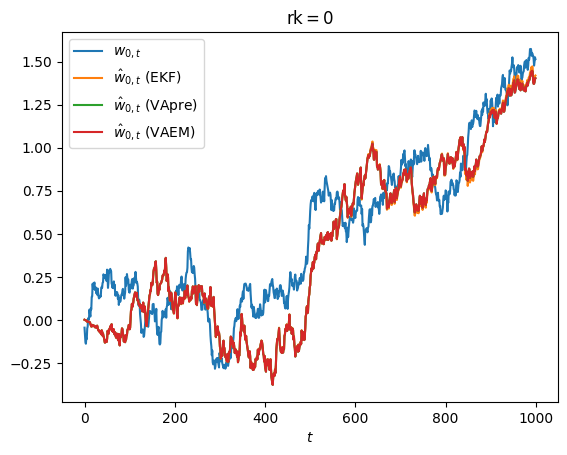

# 分析00


<!-- WARNING: THIS FILE WAS AUTOGENERATED! DO NOT EDIT! -->

## 関数定義

------------------------------------------------------------------------

### Parameter

>  Parameter (G:jaxtyping.Float[Array,'{N}{N}'],
>                 S:jaxtyping.Float[Array,'{N}{N}'],
>                 w0:jaxtyping.Float[Array,'{N}'],
>                 P0:jaxtyping.Float[Array,'{N}{N}'],
>                 epsilon:jaxtyping.Float[Array,'']=Array(1.5258789e-05,
>                 dtype=float32, weak_type=True))

* * 00_Gen によって生成するときのパラメータ。

<table>
<thead>
<tr>
<th><span class="math inline"> </span></th>
<th>Type</th>
<th>Default</th>
<th>Details</th>
</tr>
</thead>
<tbody>
<tr>
<td>G</td>
<td>Float[Array, ‘{N} {N}’]</td>
<td><span class="math inline"> </span></td>
<td><span class="math inline"><strong>Γ</strong></span></td>
</tr>
<tr>
<td>S</td>
<td>Float[Array, ‘{N} {N}’]</td>
<td><span class="math inline"> </span></td>
<td><span class="math inline"><strong>Σ</strong></span></td>
</tr>
<tr>
<td>w0</td>
<td>Float[Array, ‘{N}’]</td>
<td><span class="math inline"> </span></td>
<td><span
class="math inline"><strong>w</strong><sub>−1</sub></span></td>
</tr>
<tr>
<td>P0</td>
<td>Float[Array, ‘{N} {N}’]</td>
<td><span class="math inline"> </span></td>
<td><span
class="math inline"><strong>P</strong><sub>−1</sub></span></td>
</tr>
<tr>
<td>epsilon</td>
<td>Float[Array, ’’]</td>
<td>1.52587890625e-05</td>
<td><span class="math inline"><em>ϵ</em></span></td>
</tr>
</tbody>
</table>

* *

------------------------------------------------------------------------

### Param

>  Param (N:int, p:int, q:int, r:int)

* * 可変パラメータ。各パラメータは次のように定義される。

- *N*
- *T* = 1000
- **Γ** = 2<sup>*p*</sup>**I**
- **Σ** = 2<sup>*q*</sup>**I**
- $\mathbf w\_{-1}=(r/2)(1,\ldots,1)^T/\sqrt{N}$
- **P**<sub>−1</sub> = **Γ**
- *ϵ* = 2<sup>−16</sup>

<table>
<thead>
<tr>
<th><span class="math inline"> </span></th>
<th>Type</th>
<th>Details</th>
</tr>
</thead>
<tbody>
<tr>
<td>N</td>
<td>int</td>
<td><span class="math inline"><em>N</em></span></td>
</tr>
<tr>
<td>p</td>
<td>int</td>
<td><span class="math inline"><em>p</em></span></td>
</tr>
<tr>
<td>q</td>
<td>int</td>
<td><span class="math inline"><em>q</em></span></td>
</tr>
<tr>
<td>r</td>
<td>int</td>
<td><span class="math inline"><em>r</em></span></td>
</tr>
</tbody>
</table>

* *

------------------------------------------------------------------------

### restore_param

>  restore_param (param:__main__.Param)

* * Param から Parameter に変換する。 * *

<table>
<thead>
<tr>
<th><span class="math inline"> </span></th>
<th><strong>Type</strong></th>
<th><strong>Details</strong></th>
</tr>
</thead>
<tbody>
<tr>
<td>param</td>
<td>Param</td>
<td>Param</td>
</tr>
<tr>
<td><strong>Returns</strong></td>
<td><strong>Tuple</strong></td>
<td><strong><span class="math inline"><em>N</em></span>, <span
class="math inline"><em>T</em></span>, Parameter</strong></td>
</tr>
</tbody>
</table>

------------------------------------------------------------------------

### save_data

>  save_data (param:__main__.Param, name:str, data:dict)

* * `00_Data.h5` にデータを格納する

    .
    ├───param1
    │   ├───Gen
    │   │       W (seed, T, N)
    │   │       X (seed, T, N)
    │   │       Y (seed, T)
    │   │
    │   ├───Model1
    │   │       W (seed, T, N)
    │   │       P (seed, T, N, N)
    │   │
    │   ├───Model2
    │
    ├───param2

* *

<table>
<thead>
<tr>
<th><span class="math inline"> </span></th>
<th><strong>Type</strong></th>
<th><strong>Details</strong></th>
</tr>
</thead>
<tbody>
<tr>
<td>param</td>
<td>Param</td>
<td>Param</td>
</tr>
<tr>
<td>name</td>
<td>str</td>
<td>Model name (Gen, EKF, etc.)</td>
</tr>
<tr>
<td>data</td>
<td>dict</td>
<td>dataset_name: jnp.array</td>
</tr>
<tr>
<td><strong>Returns</strong></td>
<td><strong>None</strong></td>
<td><span class="math inline"> </span></td>
</tr>
</tbody>
</table>

------------------------------------------------------------------------

### WXY

>  WXY (W:jaxtyping.Float[Array,'TN'], X:jaxtyping.Float[Array,'TN'],
>           Y:jaxtyping.Float[Array,'T'])

* *

<table>
<thead>
<tr>
<th><span class="math inline"> </span></th>
<th>Type</th>
<th>Details</th>
</tr>
</thead>
<tbody>
<tr>
<td>W</td>
<td>Float[Array, ‘T N’]</td>
<td><span
class="math inline">{<strong>w</strong><sub><em>t</em></sub>}<sub><em>t</em> = 0, …, <em>T</em> − 1</sub></span></td>
</tr>
<tr>
<td>X</td>
<td>Float[Array, ‘T N’]</td>
<td><span
class="math inline">{<strong>x</strong><sub><em>t</em></sub>}<sub><em>t</em> = 0, …, <em>T</em> − 1</sub></span></td>
</tr>
<tr>
<td>Y</td>
<td>Float[Array, ‘T’]</td>
<td><span
class="math inline">{<em>y</em><sub><em>t</em></sub>}<sub><em>t</em> = 0, …, <em>T</em> − 1</sub></span></td>
</tr>
</tbody>
</table>

* *

------------------------------------------------------------------------

### generate

>  generate (key:Union[jaxtyping.Key[Array,''],jaxtyping.UInt32[Array,'2']],
>                N:int, T:int, p:__main__.Parameter)

<table>
<thead>
<tr>
<th><span class="math inline"> </span></th>
<th><strong>Type</strong></th>
<th><strong>Details</strong></th>
</tr>
</thead>
<tbody>
<tr>
<td>key</td>
<td>Union</td>
<td>PRNGKeyArray</td>
</tr>
<tr>
<td>N</td>
<td>int</td>
<td><span class="math inline"><em>N</em></span></td>
</tr>
<tr>
<td>T</td>
<td>int</td>
<td><span class="math inline"><em>T</em></span></td>
</tr>
<tr>
<td>p</td>
<td>Parameter</td>
<td>Parameter</td>
</tr>
<tr>
<td><strong>Returns</strong></td>
<td><strong>WXY</strong></td>
<td><span class="math inline"> </span></td>
</tr>
</tbody>
</table>

------------------------------------------------------------------------

### generate_main

>  generate_main (param:__main__.Param, seed:int)

* * データを生成し、00_Data.h5 に保存する。 * *

<table>
<thead>
<tr>
<th><span class="math inline"> </span></th>
<th><strong>Type</strong></th>
<th><strong>Details</strong></th>
</tr>
</thead>
<tbody>
<tr>
<td>param</td>
<td>Param</td>
<td>Param</td>
</tr>
<tr>
<td>seed</td>
<td>int</td>
<td>seed値</td>
</tr>
</tbody>
</table>

------------------------------------------------------------------------

### predict_main

>  predict_main (param:__main__.Param, model_name:str, func:Callable[[int,in
>                    t,jaxtyping.Float[Array,'TN'],jaxtyping.Float[Array,'T'],__
>                    main__.Parameter],NamedTuple])

* * 00_Data.h5 のデータ *X*, *Y* に対して `func` で *W*
等を推論し、保存する。 * *

<table>
<colgroup>
<col style="width: 9%" />
<col style="width: 38%" />
<col style="width: 52%" />
</colgroup>
<thead>
<tr>
<th><span class="math inline"> </span></th>
<th><strong>Type</strong></th>
<th><strong>Details</strong></th>
</tr>
</thead>
<tbody>
<tr>
<td>param</td>
<td>Param</td>
<td>Param</td>
</tr>
<tr>
<td>model_name</td>
<td>str</td>
<td>EKF, etc.</td>
</tr>
<tr>
<td>func</td>
<td>Callable</td>
<td><span class="math inline">$N,T,\{\mathbf
x_t\}_{t=0,\ldots,T-1},\{y_t\}_{t=0,\ldots,T-1},\mathrm{p}\to\{\hat{\mathbf
w_t}\}_{t=0,\ldots,T-1},\{\mathbf
P_{t/t}\}_{t=0,\ldots,T-1},\ldots$</span></td>
</tr>
</tbody>
</table>

## 関数のテスト

``` python
LOCK = True
```

## データ生成

## 分析

### 推論結果の様子



### 結果

- *N*
- *T* = 1000
- **Γ** = 2<sup>*p*</sup>**I**
- **Σ** = 2<sup>*q*</sup>**I**
- $\mathbf w\_{-1}=(r/2)(1,\ldots,1)^T/\sqrt{N}$
- **P**<sub>−1</sub> = **Γ**
- *ϵ* = 2<sup>−16</sup>

Listening on: [localhost:8060](http://localhost:8060)

        <iframe
            width="100%"
            height="1200"
            src="http://127.0.0.1:8060/"
            frameborder="0"
            allowfullscreen
            &#10;        ></iframe>
        &#10;

### 誤差

*E*({*w*<sub>0, *t*</sub>}<sub>*t* = 0, …, *T*</sub>) = {*ŵ*<sub>0, *t*</sub> − *w*<sub>0, *t*</sub>}<sub>*t* = 0, …, *T*</sub>

- *N*
- *T* = 1000
- **Γ** = 2<sup>*p*</sup>**I**
- **Σ** = 2<sup>*q*</sup>**I**
- $\mathbf w\_{-1}=(r/2)(1,\ldots,1)^T/\sqrt{N}$
- **P**<sub>−1</sub> = **Γ**
- *ϵ* = 2<sup>−16</sup>

Listening on: [localhost:8070](http://localhost:8070)

        <iframe
            width="100%"
            height="650"
            src="http://127.0.0.1:8070/"
            frameborder="0"
            allowfullscreen
            &#10;        ></iframe>
        &#10;

Listening on: [localhost:8061](http://localhost:8061)

        <iframe
            width="100%"
            height="650"
            src="http://127.0.0.1:8061/"
            frameborder="0"
            allowfullscreen
            &#10;        ></iframe>
        

<div>
<style scoped>
    .dataframe tbody tr th:only-of-type {
        vertical-align: middle;
    }
&#10;    .dataframe tbody tr th {
        vertical-align: top;
    }
&#10;    .dataframe thead th {
        text-align: right;
    }
</style>

<table class="dataframe" data-quarto-postprocess="true" data-border="1">
<thead>
<tr style="text-align: right;">
<th data-quarto-table-cell-role="th"></th>
<th data-quarto-table-cell-role="th">algorithm</th>
<th data-quarto-table-cell-role="th">frob_error</th>
<th data-quarto-table-cell-role="th">relative_error</th>
</tr>
<tr>
<th data-quarto-table-cell-role="th">p</th>
<th data-quarto-table-cell-role="th"></th>
<th data-quarto-table-cell-role="th"></th>
<th data-quarto-table-cell-role="th"></th>
</tr>
</thead>
<tbody>
<tr>
<td data-quarto-table-cell-role="th">-4</td>
<td>EKF</td>
<td>5.580760</td>
<td>63.139098</td>
</tr>
<tr>
<td data-quarto-table-cell-role="th">-4</td>
<td>VApre</td>
<td>1.658594</td>
<td>18.764848</td>
</tr>
<tr>
<td data-quarto-table-cell-role="th">-4</td>
<td>VAEM</td>
<td>1.655468</td>
<td>18.729480</td>
</tr>
<tr>
<td data-quarto-table-cell-role="th">-6</td>
<td>EKF</td>
<td>1.061542</td>
<td>48.039904</td>
</tr>
<tr>
<td data-quarto-table-cell-role="th">-6</td>
<td>VApre</td>
<td>0.723463</td>
<td>32.740207</td>
</tr>
<tr>
<td data-quarto-table-cell-role="th">-6</td>
<td>VAEM</td>
<td>0.722900</td>
<td>32.714732</td>
</tr>
<tr>
<td data-quarto-table-cell-role="th">-8</td>
<td>EKF</td>
<td>0.375931</td>
<td>68.050840</td>
</tr>
<tr>
<td data-quarto-table-cell-role="th">-8</td>
<td>VApre</td>
<td>0.341001</td>
<td>61.727846</td>
</tr>
<tr>
<td data-quarto-table-cell-role="th">-8</td>
<td>VAEM</td>
<td>0.340927</td>
<td>61.714354</td>
</tr>
<tr>
<td data-quarto-table-cell-role="th">-10</td>
<td>EKF</td>
<td>0.164551</td>
<td>119.147344</td>
</tr>
<tr>
<td data-quarto-table-cell-role="th">-10</td>
<td>VApre</td>
<td>0.161168</td>
<td>116.698451</td>
</tr>
<tr>
<td data-quarto-table-cell-role="th">-10</td>
<td>VAEM</td>
<td>0.161162</td>
<td>116.693650</td>
</tr>
<tr>
<td data-quarto-table-cell-role="th">-12</td>
<td>EKF</td>
<td>0.072807</td>
<td>210.870368</td>
</tr>
<tr>
<td data-quarto-table-cell-role="th">-12</td>
<td>VApre</td>
<td>0.072609</td>
<td>210.298627</td>
</tr>
<tr>
<td data-quarto-table-cell-role="th">-12</td>
<td>VAEM</td>
<td>0.072609</td>
<td>210.297181</td>
</tr>
</tbody>
</table>

</div>


