# 分析01


<!-- WARNING: THIS FILE WAS AUTOGENERATED! DO NOT EDIT! -->

## dow_jones_index

https://archive.ics.uci.edu/dataset/312/dow+jones+index

This dataset contains weekly data for the Dow Jones Industrial Index. It
has been used in computational investing research.

<table>
<colgroup>
<col style="width: 61%" />
<col style="width: 38%" />
</colgroup>
<thead>
<tr>
<th style="text-align: left;">項目名</th>
<th style="text-align: left;">説明</th>
</tr>
</thead>
<tbody>
<tr>
<td style="text-align: left;"><strong>quarter</strong></td>
<td style="text-align: left;">年間の四半期（1 = 1〜3月、2 =
4〜6月）</td>
</tr>
<tr>
<td style="text-align: left;"><strong>stock</strong></td>
<td style="text-align: left;">株式のシンボル（ティッカーコード）</td>
</tr>
<tr>
<td style="text-align: left;"><strong>date</strong></td>
<td style="text-align: left;">週の最終営業日（通常は金曜日）</td>
</tr>
<tr>
<td style="text-align: left;"><strong>open</strong></td>
<td style="text-align: left;">週の始めの株価（始値）</td>
</tr>
<tr>
<td style="text-align: left;"><strong>high</strong></td>
<td style="text-align: left;">週の最高株価</td>
</tr>
<tr>
<td style="text-align: left;"><strong>low</strong></td>
<td style="text-align: left;">週の最安株価</td>
</tr>
<tr>
<td style="text-align: left;"><strong>close</strong></td>
<td style="text-align: left;">週の終わりの株価（終値）</td>
</tr>
<tr>
<td style="text-align: left;"><strong>volume</strong></td>
<td
style="text-align: left;">その週に取引された株式の出来高（取引株数）</td>
</tr>
<tr>
<td style="text-align: left;"><strong>percent_change_price</strong></td>
<td style="text-align: left;">週を通しての株価変動率（％）</td>
</tr>
<tr>
<td
style="text-align: left;"><strong>percent_change_volume_over_last_week</strong></td>
<td style="text-align: left;">前週と比較した出来高の変化率（％）</td>
</tr>
<tr>
<td
style="text-align: left;"><strong>previous_weeks_volume</strong></td>
<td style="text-align: left;">前週の出来高（取引株数）</td>
</tr>
<tr>
<td style="text-align: left;"><strong>next_weeks_open</strong></td>
<td style="text-align: left;">翌週の始値</td>
</tr>
<tr>
<td style="text-align: left;"><strong>next_weeks_close</strong></td>
<td style="text-align: left;">翌週の終値</td>
</tr>
<tr>
<td
style="text-align: left;"><strong>percent_change_next_weeks_price</strong></td>
<td style="text-align: left;">翌週の株価変動率（％）</td>
</tr>
<tr>
<td
style="text-align: left;"><strong>days_to_next_dividend</strong></td>
<td style="text-align: left;">次回配当までの日数</td>
</tr>
<tr>
<td
style="text-align: left;"><strong>percent_return_next_dividend</strong></td>
<td style="text-align: left;">次回配当による利回り（％）</td>
</tr>
</tbody>
</table>

``` python
df = pd.read_csv("01_Data/dow_jones_index/dow_jones_index.data")
df
```

<div>
<style scoped>
    .dataframe tbody tr th:only-of-type {
        vertical-align: middle;
    }
&#10;    .dataframe tbody tr th {
        vertical-align: top;
    }
&#10;    .dataframe thead th {
        text-align: right;
    }
</style>

<table class="dataframe" data-quarto-postprocess="true" data-border="1">
<thead>
<tr style="text-align: right;">
<th data-quarto-table-cell-role="th"></th>
<th data-quarto-table-cell-role="th">quarter</th>
<th data-quarto-table-cell-role="th">stock</th>
<th data-quarto-table-cell-role="th">date</th>
<th data-quarto-table-cell-role="th">open</th>
<th data-quarto-table-cell-role="th">high</th>
<th data-quarto-table-cell-role="th">low</th>
<th data-quarto-table-cell-role="th">close</th>
<th data-quarto-table-cell-role="th">volume</th>
<th data-quarto-table-cell-role="th">percent_change_price</th>
<th
data-quarto-table-cell-role="th">percent_change_volume_over_last_wk</th>
<th data-quarto-table-cell-role="th">previous_weeks_volume</th>
<th data-quarto-table-cell-role="th">next_weeks_open</th>
<th data-quarto-table-cell-role="th">next_weeks_close</th>
<th
data-quarto-table-cell-role="th">percent_change_next_weeks_price</th>
<th data-quarto-table-cell-role="th">days_to_next_dividend</th>
<th data-quarto-table-cell-role="th">percent_return_next_dividend</th>
</tr>
</thead>
<tbody>
<tr>
<td data-quarto-table-cell-role="th">0</td>
<td>1</td>
<td>AA</td>
<td>1/7/2011</td>
<td>$15.82</td>
<td>$16.72</td>
<td>$15.78</td>
<td>$16.42</td>
<td>239655616</td>
<td>3.79267</td>
<td>NaN</td>
<td>NaN</td>
<td>$16.71</td>
<td>$15.97</td>
<td>-4.428490</td>
<td>26</td>
<td>0.182704</td>
</tr>
<tr>
<td data-quarto-table-cell-role="th">1</td>
<td>1</td>
<td>AA</td>
<td>1/14/2011</td>
<td>$16.71</td>
<td>$16.71</td>
<td>$15.64</td>
<td>$15.97</td>
<td>242963398</td>
<td>-4.42849</td>
<td>1.380223</td>
<td>239655616.0</td>
<td>$16.19</td>
<td>$15.79</td>
<td>-2.470660</td>
<td>19</td>
<td>0.187852</td>
</tr>
<tr>
<td data-quarto-table-cell-role="th">2</td>
<td>1</td>
<td>AA</td>
<td>1/21/2011</td>
<td>$16.19</td>
<td>$16.38</td>
<td>$15.60</td>
<td>$15.79</td>
<td>138428495</td>
<td>-2.47066</td>
<td>-43.024959</td>
<td>242963398.0</td>
<td>$15.87</td>
<td>$16.13</td>
<td>1.638310</td>
<td>12</td>
<td>0.189994</td>
</tr>
<tr>
<td data-quarto-table-cell-role="th">3</td>
<td>1</td>
<td>AA</td>
<td>1/28/2011</td>
<td>$15.87</td>
<td>$16.63</td>
<td>$15.82</td>
<td>$16.13</td>
<td>151379173</td>
<td>1.63831</td>
<td>9.355500</td>
<td>138428495.0</td>
<td>$16.18</td>
<td>$17.14</td>
<td>5.933250</td>
<td>5</td>
<td>0.185989</td>
</tr>
<tr>
<td data-quarto-table-cell-role="th">4</td>
<td>1</td>
<td>AA</td>
<td>2/4/2011</td>
<td>$16.18</td>
<td>$17.39</td>
<td>$16.18</td>
<td>$17.14</td>
<td>154387761</td>
<td>5.93325</td>
<td>1.987452</td>
<td>151379173.0</td>
<td>$17.33</td>
<td>$17.37</td>
<td>0.230814</td>
<td>97</td>
<td>0.175029</td>
</tr>
<tr>
<td data-quarto-table-cell-role="th">...</td>
<td>...</td>
<td>...</td>
<td>...</td>
<td>...</td>
<td>...</td>
<td>...</td>
<td>...</td>
<td>...</td>
<td>...</td>
<td>...</td>
<td>...</td>
<td>...</td>
<td>...</td>
<td>...</td>
<td>...</td>
<td>...</td>
</tr>
<tr>
<td data-quarto-table-cell-role="th">745</td>
<td>2</td>
<td>XOM</td>
<td>5/27/2011</td>
<td>$80.22</td>
<td>$82.63</td>
<td>$80.07</td>
<td>$82.63</td>
<td>68230855</td>
<td>3.00424</td>
<td>-21.355713</td>
<td>86758820.0</td>
<td>$83.28</td>
<td>$81.18</td>
<td>-2.521610</td>
<td>75</td>
<td>0.568801</td>
</tr>
<tr>
<td data-quarto-table-cell-role="th">746</td>
<td>2</td>
<td>XOM</td>
<td>6/3/2011</td>
<td>$83.28</td>
<td>$83.75</td>
<td>$80.18</td>
<td>$81.18</td>
<td>78616295</td>
<td>-2.52161</td>
<td>15.221032</td>
<td>68230855.0</td>
<td>$80.93</td>
<td>$79.78</td>
<td>-1.420980</td>
<td>68</td>
<td>0.578960</td>
</tr>
<tr>
<td data-quarto-table-cell-role="th">747</td>
<td>2</td>
<td>XOM</td>
<td>6/10/2011</td>
<td>$80.93</td>
<td>$81.87</td>
<td>$79.72</td>
<td>$79.78</td>
<td>92380844</td>
<td>-1.42098</td>
<td>17.508519</td>
<td>78616295.0</td>
<td>$80.00</td>
<td>$79.02</td>
<td>-1.225000</td>
<td>61</td>
<td>0.589120</td>
</tr>
<tr>
<td data-quarto-table-cell-role="th">748</td>
<td>2</td>
<td>XOM</td>
<td>6/17/2011</td>
<td>$80.00</td>
<td>$80.82</td>
<td>$78.33</td>
<td>$79.02</td>
<td>100521400</td>
<td>-1.22500</td>
<td>8.811952</td>
<td>92380844.0</td>
<td>$78.65</td>
<td>$76.78</td>
<td>-2.377620</td>
<td>54</td>
<td>0.594786</td>
</tr>
<tr>
<td data-quarto-table-cell-role="th">749</td>
<td>2</td>
<td>XOM</td>
<td>6/24/2011</td>
<td>$78.65</td>
<td>$81.12</td>
<td>$76.78</td>
<td>$76.78</td>
<td>118679791</td>
<td>-2.37762</td>
<td>18.064204</td>
<td>100521400.0</td>
<td>$76.88</td>
<td>$82.01</td>
<td>6.672740</td>
<td>47</td>
<td>0.612139</td>
</tr>
</tbody>
</table>

<p>750 rows × 16 columns</p>
</div>

``` python
df1 = df.set_index("date")
df1
```

<div>
<style scoped>
    .dataframe tbody tr th:only-of-type {
        vertical-align: middle;
    }
&#10;    .dataframe tbody tr th {
        vertical-align: top;
    }
&#10;    .dataframe thead th {
        text-align: right;
    }
</style>

<table class="dataframe" data-quarto-postprocess="true" data-border="1">
<thead>
<tr style="text-align: right;">
<th data-quarto-table-cell-role="th"></th>
<th data-quarto-table-cell-role="th">quarter</th>
<th data-quarto-table-cell-role="th">stock</th>
<th data-quarto-table-cell-role="th">open</th>
<th data-quarto-table-cell-role="th">high</th>
<th data-quarto-table-cell-role="th">low</th>
<th data-quarto-table-cell-role="th">close</th>
<th data-quarto-table-cell-role="th">volume</th>
<th data-quarto-table-cell-role="th">percent_change_price</th>
<th
data-quarto-table-cell-role="th">percent_change_volume_over_last_wk</th>
<th data-quarto-table-cell-role="th">previous_weeks_volume</th>
<th data-quarto-table-cell-role="th">next_weeks_open</th>
<th data-quarto-table-cell-role="th">next_weeks_close</th>
<th
data-quarto-table-cell-role="th">percent_change_next_weeks_price</th>
<th data-quarto-table-cell-role="th">days_to_next_dividend</th>
<th data-quarto-table-cell-role="th">percent_return_next_dividend</th>
</tr>
<tr>
<th data-quarto-table-cell-role="th">date</th>
<th data-quarto-table-cell-role="th"></th>
<th data-quarto-table-cell-role="th"></th>
<th data-quarto-table-cell-role="th"></th>
<th data-quarto-table-cell-role="th"></th>
<th data-quarto-table-cell-role="th"></th>
<th data-quarto-table-cell-role="th"></th>
<th data-quarto-table-cell-role="th"></th>
<th data-quarto-table-cell-role="th"></th>
<th data-quarto-table-cell-role="th"></th>
<th data-quarto-table-cell-role="th"></th>
<th data-quarto-table-cell-role="th"></th>
<th data-quarto-table-cell-role="th"></th>
<th data-quarto-table-cell-role="th"></th>
<th data-quarto-table-cell-role="th"></th>
<th data-quarto-table-cell-role="th"></th>
</tr>
</thead>
<tbody>
<tr>
<td data-quarto-table-cell-role="th">1/7/2011</td>
<td>1</td>
<td>AA</td>
<td>$15.82</td>
<td>$16.72</td>
<td>$15.78</td>
<td>$16.42</td>
<td>239655616</td>
<td>3.79267</td>
<td>NaN</td>
<td>NaN</td>
<td>$16.71</td>
<td>$15.97</td>
<td>-4.428490</td>
<td>26</td>
<td>0.182704</td>
</tr>
<tr>
<td data-quarto-table-cell-role="th">1/14/2011</td>
<td>1</td>
<td>AA</td>
<td>$16.71</td>
<td>$16.71</td>
<td>$15.64</td>
<td>$15.97</td>
<td>242963398</td>
<td>-4.42849</td>
<td>1.380223</td>
<td>239655616.0</td>
<td>$16.19</td>
<td>$15.79</td>
<td>-2.470660</td>
<td>19</td>
<td>0.187852</td>
</tr>
<tr>
<td data-quarto-table-cell-role="th">1/21/2011</td>
<td>1</td>
<td>AA</td>
<td>$16.19</td>
<td>$16.38</td>
<td>$15.60</td>
<td>$15.79</td>
<td>138428495</td>
<td>-2.47066</td>
<td>-43.024959</td>
<td>242963398.0</td>
<td>$15.87</td>
<td>$16.13</td>
<td>1.638310</td>
<td>12</td>
<td>0.189994</td>
</tr>
<tr>
<td data-quarto-table-cell-role="th">1/28/2011</td>
<td>1</td>
<td>AA</td>
<td>$15.87</td>
<td>$16.63</td>
<td>$15.82</td>
<td>$16.13</td>
<td>151379173</td>
<td>1.63831</td>
<td>9.355500</td>
<td>138428495.0</td>
<td>$16.18</td>
<td>$17.14</td>
<td>5.933250</td>
<td>5</td>
<td>0.185989</td>
</tr>
<tr>
<td data-quarto-table-cell-role="th">2/4/2011</td>
<td>1</td>
<td>AA</td>
<td>$16.18</td>
<td>$17.39</td>
<td>$16.18</td>
<td>$17.14</td>
<td>154387761</td>
<td>5.93325</td>
<td>1.987452</td>
<td>151379173.0</td>
<td>$17.33</td>
<td>$17.37</td>
<td>0.230814</td>
<td>97</td>
<td>0.175029</td>
</tr>
<tr>
<td data-quarto-table-cell-role="th">...</td>
<td>...</td>
<td>...</td>
<td>...</td>
<td>...</td>
<td>...</td>
<td>...</td>
<td>...</td>
<td>...</td>
<td>...</td>
<td>...</td>
<td>...</td>
<td>...</td>
<td>...</td>
<td>...</td>
<td>...</td>
</tr>
<tr>
<td data-quarto-table-cell-role="th">5/27/2011</td>
<td>2</td>
<td>XOM</td>
<td>$80.22</td>
<td>$82.63</td>
<td>$80.07</td>
<td>$82.63</td>
<td>68230855</td>
<td>3.00424</td>
<td>-21.355713</td>
<td>86758820.0</td>
<td>$83.28</td>
<td>$81.18</td>
<td>-2.521610</td>
<td>75</td>
<td>0.568801</td>
</tr>
<tr>
<td data-quarto-table-cell-role="th">6/3/2011</td>
<td>2</td>
<td>XOM</td>
<td>$83.28</td>
<td>$83.75</td>
<td>$80.18</td>
<td>$81.18</td>
<td>78616295</td>
<td>-2.52161</td>
<td>15.221032</td>
<td>68230855.0</td>
<td>$80.93</td>
<td>$79.78</td>
<td>-1.420980</td>
<td>68</td>
<td>0.578960</td>
</tr>
<tr>
<td data-quarto-table-cell-role="th">6/10/2011</td>
<td>2</td>
<td>XOM</td>
<td>$80.93</td>
<td>$81.87</td>
<td>$79.72</td>
<td>$79.78</td>
<td>92380844</td>
<td>-1.42098</td>
<td>17.508519</td>
<td>78616295.0</td>
<td>$80.00</td>
<td>$79.02</td>
<td>-1.225000</td>
<td>61</td>
<td>0.589120</td>
</tr>
<tr>
<td data-quarto-table-cell-role="th">6/17/2011</td>
<td>2</td>
<td>XOM</td>
<td>$80.00</td>
<td>$80.82</td>
<td>$78.33</td>
<td>$79.02</td>
<td>100521400</td>
<td>-1.22500</td>
<td>8.811952</td>
<td>92380844.0</td>
<td>$78.65</td>
<td>$76.78</td>
<td>-2.377620</td>
<td>54</td>
<td>0.594786</td>
</tr>
<tr>
<td data-quarto-table-cell-role="th">6/24/2011</td>
<td>2</td>
<td>XOM</td>
<td>$78.65</td>
<td>$81.12</td>
<td>$76.78</td>
<td>$76.78</td>
<td>118679791</td>
<td>-2.37762</td>
<td>18.064204</td>
<td>100521400.0</td>
<td>$76.88</td>
<td>$82.01</td>
<td>6.672740</td>
<td>47</td>
<td>0.612139</td>
</tr>
</tbody>
</table>

<p>750 rows × 15 columns</p>
</div>

``` python
df1.plot()
```

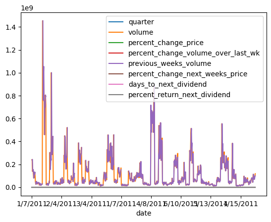

- x quarter

``` python
dol_cols = [
  "open", 
  "high", 
  "low", 
  "close", 
  "next_weeks_open", 
  "next_weeks_close"
  ]

df1[dol_cols] = (
    df1[dol_cols]
    .replace('[\$,]', '', regex=True)  # $, , を削除
    .astype(float)                     # float型に変換
)
```

``` python
df1
```

<div>
<style scoped>
    .dataframe tbody tr th:only-of-type {
        vertical-align: middle;
    }
&#10;    .dataframe tbody tr th {
        vertical-align: top;
    }
&#10;    .dataframe thead th {
        text-align: right;
    }
</style>

<table class="dataframe" data-quarto-postprocess="true" data-border="1">
<thead>
<tr style="text-align: right;">
<th data-quarto-table-cell-role="th"></th>
<th data-quarto-table-cell-role="th">quarter</th>
<th data-quarto-table-cell-role="th">stock</th>
<th data-quarto-table-cell-role="th">open</th>
<th data-quarto-table-cell-role="th">high</th>
<th data-quarto-table-cell-role="th">low</th>
<th data-quarto-table-cell-role="th">close</th>
<th data-quarto-table-cell-role="th">volume</th>
<th data-quarto-table-cell-role="th">percent_change_price</th>
<th
data-quarto-table-cell-role="th">percent_change_volume_over_last_wk</th>
<th data-quarto-table-cell-role="th">previous_weeks_volume</th>
<th data-quarto-table-cell-role="th">next_weeks_open</th>
<th data-quarto-table-cell-role="th">next_weeks_close</th>
<th
data-quarto-table-cell-role="th">percent_change_next_weeks_price</th>
<th data-quarto-table-cell-role="th">days_to_next_dividend</th>
<th data-quarto-table-cell-role="th">percent_return_next_dividend</th>
</tr>
<tr>
<th data-quarto-table-cell-role="th">date</th>
<th data-quarto-table-cell-role="th"></th>
<th data-quarto-table-cell-role="th"></th>
<th data-quarto-table-cell-role="th"></th>
<th data-quarto-table-cell-role="th"></th>
<th data-quarto-table-cell-role="th"></th>
<th data-quarto-table-cell-role="th"></th>
<th data-quarto-table-cell-role="th"></th>
<th data-quarto-table-cell-role="th"></th>
<th data-quarto-table-cell-role="th"></th>
<th data-quarto-table-cell-role="th"></th>
<th data-quarto-table-cell-role="th"></th>
<th data-quarto-table-cell-role="th"></th>
<th data-quarto-table-cell-role="th"></th>
<th data-quarto-table-cell-role="th"></th>
<th data-quarto-table-cell-role="th"></th>
</tr>
</thead>
<tbody>
<tr>
<td data-quarto-table-cell-role="th">1/7/2011</td>
<td>1</td>
<td>AA</td>
<td>15.82</td>
<td>16.72</td>
<td>15.78</td>
<td>16.42</td>
<td>239655616</td>
<td>3.79267</td>
<td>NaN</td>
<td>NaN</td>
<td>16.71</td>
<td>15.97</td>
<td>-4.428490</td>
<td>26</td>
<td>0.182704</td>
</tr>
<tr>
<td data-quarto-table-cell-role="th">1/14/2011</td>
<td>1</td>
<td>AA</td>
<td>16.71</td>
<td>16.71</td>
<td>15.64</td>
<td>15.97</td>
<td>242963398</td>
<td>-4.42849</td>
<td>1.380223</td>
<td>239655616.0</td>
<td>16.19</td>
<td>15.79</td>
<td>-2.470660</td>
<td>19</td>
<td>0.187852</td>
</tr>
<tr>
<td data-quarto-table-cell-role="th">1/21/2011</td>
<td>1</td>
<td>AA</td>
<td>16.19</td>
<td>16.38</td>
<td>15.60</td>
<td>15.79</td>
<td>138428495</td>
<td>-2.47066</td>
<td>-43.024959</td>
<td>242963398.0</td>
<td>15.87</td>
<td>16.13</td>
<td>1.638310</td>
<td>12</td>
<td>0.189994</td>
</tr>
<tr>
<td data-quarto-table-cell-role="th">1/28/2011</td>
<td>1</td>
<td>AA</td>
<td>15.87</td>
<td>16.63</td>
<td>15.82</td>
<td>16.13</td>
<td>151379173</td>
<td>1.63831</td>
<td>9.355500</td>
<td>138428495.0</td>
<td>16.18</td>
<td>17.14</td>
<td>5.933250</td>
<td>5</td>
<td>0.185989</td>
</tr>
<tr>
<td data-quarto-table-cell-role="th">2/4/2011</td>
<td>1</td>
<td>AA</td>
<td>16.18</td>
<td>17.39</td>
<td>16.18</td>
<td>17.14</td>
<td>154387761</td>
<td>5.93325</td>
<td>1.987452</td>
<td>151379173.0</td>
<td>17.33</td>
<td>17.37</td>
<td>0.230814</td>
<td>97</td>
<td>0.175029</td>
</tr>
<tr>
<td data-quarto-table-cell-role="th">...</td>
<td>...</td>
<td>...</td>
<td>...</td>
<td>...</td>
<td>...</td>
<td>...</td>
<td>...</td>
<td>...</td>
<td>...</td>
<td>...</td>
<td>...</td>
<td>...</td>
<td>...</td>
<td>...</td>
<td>...</td>
</tr>
<tr>
<td data-quarto-table-cell-role="th">5/27/2011</td>
<td>2</td>
<td>XOM</td>
<td>80.22</td>
<td>82.63</td>
<td>80.07</td>
<td>82.63</td>
<td>68230855</td>
<td>3.00424</td>
<td>-21.355713</td>
<td>86758820.0</td>
<td>83.28</td>
<td>81.18</td>
<td>-2.521610</td>
<td>75</td>
<td>0.568801</td>
</tr>
<tr>
<td data-quarto-table-cell-role="th">6/3/2011</td>
<td>2</td>
<td>XOM</td>
<td>83.28</td>
<td>83.75</td>
<td>80.18</td>
<td>81.18</td>
<td>78616295</td>
<td>-2.52161</td>
<td>15.221032</td>
<td>68230855.0</td>
<td>80.93</td>
<td>79.78</td>
<td>-1.420980</td>
<td>68</td>
<td>0.578960</td>
</tr>
<tr>
<td data-quarto-table-cell-role="th">6/10/2011</td>
<td>2</td>
<td>XOM</td>
<td>80.93</td>
<td>81.87</td>
<td>79.72</td>
<td>79.78</td>
<td>92380844</td>
<td>-1.42098</td>
<td>17.508519</td>
<td>78616295.0</td>
<td>80.00</td>
<td>79.02</td>
<td>-1.225000</td>
<td>61</td>
<td>0.589120</td>
</tr>
<tr>
<td data-quarto-table-cell-role="th">6/17/2011</td>
<td>2</td>
<td>XOM</td>
<td>80.00</td>
<td>80.82</td>
<td>78.33</td>
<td>79.02</td>
<td>100521400</td>
<td>-1.22500</td>
<td>8.811952</td>
<td>92380844.0</td>
<td>78.65</td>
<td>76.78</td>
<td>-2.377620</td>
<td>54</td>
<td>0.594786</td>
</tr>
<tr>
<td data-quarto-table-cell-role="th">6/24/2011</td>
<td>2</td>
<td>XOM</td>
<td>78.65</td>
<td>81.12</td>
<td>76.78</td>
<td>76.78</td>
<td>118679791</td>
<td>-2.37762</td>
<td>18.064204</td>
<td>100521400.0</td>
<td>76.88</td>
<td>82.01</td>
<td>6.672740</td>
<td>47</td>
<td>0.612139</td>
</tr>
</tbody>
</table>

<p>750 rows × 15 columns</p>
</div>

``` python
df1.groupby("stock").count()
```

<div>
<style scoped>
    .dataframe tbody tr th:only-of-type {
        vertical-align: middle;
    }
&#10;    .dataframe tbody tr th {
        vertical-align: top;
    }
&#10;    .dataframe thead th {
        text-align: right;
    }
</style>

<table class="dataframe" data-quarto-postprocess="true" data-border="1">
<thead>
<tr style="text-align: right;">
<th data-quarto-table-cell-role="th"></th>
<th data-quarto-table-cell-role="th">quarter</th>
<th data-quarto-table-cell-role="th">open</th>
<th data-quarto-table-cell-role="th">high</th>
<th data-quarto-table-cell-role="th">low</th>
<th data-quarto-table-cell-role="th">close</th>
<th data-quarto-table-cell-role="th">volume</th>
<th data-quarto-table-cell-role="th">percent_change_price</th>
<th
data-quarto-table-cell-role="th">percent_change_volume_over_last_wk</th>
<th data-quarto-table-cell-role="th">previous_weeks_volume</th>
<th data-quarto-table-cell-role="th">next_weeks_open</th>
<th data-quarto-table-cell-role="th">next_weeks_close</th>
<th
data-quarto-table-cell-role="th">percent_change_next_weeks_price</th>
<th data-quarto-table-cell-role="th">days_to_next_dividend</th>
<th data-quarto-table-cell-role="th">percent_return_next_dividend</th>
</tr>
<tr>
<th data-quarto-table-cell-role="th">stock</th>
<th data-quarto-table-cell-role="th"></th>
<th data-quarto-table-cell-role="th"></th>
<th data-quarto-table-cell-role="th"></th>
<th data-quarto-table-cell-role="th"></th>
<th data-quarto-table-cell-role="th"></th>
<th data-quarto-table-cell-role="th"></th>
<th data-quarto-table-cell-role="th"></th>
<th data-quarto-table-cell-role="th"></th>
<th data-quarto-table-cell-role="th"></th>
<th data-quarto-table-cell-role="th"></th>
<th data-quarto-table-cell-role="th"></th>
<th data-quarto-table-cell-role="th"></th>
<th data-quarto-table-cell-role="th"></th>
<th data-quarto-table-cell-role="th"></th>
</tr>
</thead>
<tbody>
<tr>
<td data-quarto-table-cell-role="th">AA</td>
<td>25</td>
<td>25</td>
<td>25</td>
<td>25</td>
<td>25</td>
<td>25</td>
<td>25</td>
<td>24</td>
<td>24</td>
<td>25</td>
<td>25</td>
<td>25</td>
<td>25</td>
<td>25</td>
</tr>
<tr>
<td data-quarto-table-cell-role="th">AXP</td>
<td>25</td>
<td>25</td>
<td>25</td>
<td>25</td>
<td>25</td>
<td>25</td>
<td>25</td>
<td>24</td>
<td>24</td>
<td>25</td>
<td>25</td>
<td>25</td>
<td>25</td>
<td>25</td>
</tr>
<tr>
<td data-quarto-table-cell-role="th">BA</td>
<td>25</td>
<td>25</td>
<td>25</td>
<td>25</td>
<td>25</td>
<td>25</td>
<td>25</td>
<td>24</td>
<td>24</td>
<td>25</td>
<td>25</td>
<td>25</td>
<td>25</td>
<td>25</td>
</tr>
<tr>
<td data-quarto-table-cell-role="th">BAC</td>
<td>25</td>
<td>25</td>
<td>25</td>
<td>25</td>
<td>25</td>
<td>25</td>
<td>25</td>
<td>24</td>
<td>24</td>
<td>25</td>
<td>25</td>
<td>25</td>
<td>25</td>
<td>25</td>
</tr>
<tr>
<td data-quarto-table-cell-role="th">CAT</td>
<td>25</td>
<td>25</td>
<td>25</td>
<td>25</td>
<td>25</td>
<td>25</td>
<td>25</td>
<td>24</td>
<td>24</td>
<td>25</td>
<td>25</td>
<td>25</td>
<td>25</td>
<td>25</td>
</tr>
<tr>
<td data-quarto-table-cell-role="th">CSCO</td>
<td>25</td>
<td>25</td>
<td>25</td>
<td>25</td>
<td>25</td>
<td>25</td>
<td>25</td>
<td>24</td>
<td>24</td>
<td>25</td>
<td>25</td>
<td>25</td>
<td>25</td>
<td>25</td>
</tr>
<tr>
<td data-quarto-table-cell-role="th">CVX</td>
<td>25</td>
<td>25</td>
<td>25</td>
<td>25</td>
<td>25</td>
<td>25</td>
<td>25</td>
<td>24</td>
<td>24</td>
<td>25</td>
<td>25</td>
<td>25</td>
<td>25</td>
<td>25</td>
</tr>
<tr>
<td data-quarto-table-cell-role="th">DD</td>
<td>25</td>
<td>25</td>
<td>25</td>
<td>25</td>
<td>25</td>
<td>25</td>
<td>25</td>
<td>24</td>
<td>24</td>
<td>25</td>
<td>25</td>
<td>25</td>
<td>25</td>
<td>25</td>
</tr>
<tr>
<td data-quarto-table-cell-role="th">DIS</td>
<td>25</td>
<td>25</td>
<td>25</td>
<td>25</td>
<td>25</td>
<td>25</td>
<td>25</td>
<td>24</td>
<td>24</td>
<td>25</td>
<td>25</td>
<td>25</td>
<td>25</td>
<td>25</td>
</tr>
<tr>
<td data-quarto-table-cell-role="th">GE</td>
<td>25</td>
<td>25</td>
<td>25</td>
<td>25</td>
<td>25</td>
<td>25</td>
<td>25</td>
<td>24</td>
<td>24</td>
<td>25</td>
<td>25</td>
<td>25</td>
<td>25</td>
<td>25</td>
</tr>
<tr>
<td data-quarto-table-cell-role="th">HD</td>
<td>25</td>
<td>25</td>
<td>25</td>
<td>25</td>
<td>25</td>
<td>25</td>
<td>25</td>
<td>24</td>
<td>24</td>
<td>25</td>
<td>25</td>
<td>25</td>
<td>25</td>
<td>25</td>
</tr>
<tr>
<td data-quarto-table-cell-role="th">HPQ</td>
<td>25</td>
<td>25</td>
<td>25</td>
<td>25</td>
<td>25</td>
<td>25</td>
<td>25</td>
<td>24</td>
<td>24</td>
<td>25</td>
<td>25</td>
<td>25</td>
<td>25</td>
<td>25</td>
</tr>
<tr>
<td data-quarto-table-cell-role="th">IBM</td>
<td>25</td>
<td>25</td>
<td>25</td>
<td>25</td>
<td>25</td>
<td>25</td>
<td>25</td>
<td>24</td>
<td>24</td>
<td>25</td>
<td>25</td>
<td>25</td>
<td>25</td>
<td>25</td>
</tr>
<tr>
<td data-quarto-table-cell-role="th">INTC</td>
<td>25</td>
<td>25</td>
<td>25</td>
<td>25</td>
<td>25</td>
<td>25</td>
<td>25</td>
<td>24</td>
<td>24</td>
<td>25</td>
<td>25</td>
<td>25</td>
<td>25</td>
<td>25</td>
</tr>
<tr>
<td data-quarto-table-cell-role="th">JNJ</td>
<td>25</td>
<td>25</td>
<td>25</td>
<td>25</td>
<td>25</td>
<td>25</td>
<td>25</td>
<td>24</td>
<td>24</td>
<td>25</td>
<td>25</td>
<td>25</td>
<td>25</td>
<td>25</td>
</tr>
<tr>
<td data-quarto-table-cell-role="th">JPM</td>
<td>25</td>
<td>25</td>
<td>25</td>
<td>25</td>
<td>25</td>
<td>25</td>
<td>25</td>
<td>24</td>
<td>24</td>
<td>25</td>
<td>25</td>
<td>25</td>
<td>25</td>
<td>25</td>
</tr>
<tr>
<td data-quarto-table-cell-role="th">KO</td>
<td>25</td>
<td>25</td>
<td>25</td>
<td>25</td>
<td>25</td>
<td>25</td>
<td>25</td>
<td>24</td>
<td>24</td>
<td>25</td>
<td>25</td>
<td>25</td>
<td>25</td>
<td>25</td>
</tr>
<tr>
<td data-quarto-table-cell-role="th">KRFT</td>
<td>25</td>
<td>25</td>
<td>25</td>
<td>25</td>
<td>25</td>
<td>25</td>
<td>25</td>
<td>24</td>
<td>24</td>
<td>25</td>
<td>25</td>
<td>25</td>
<td>25</td>
<td>25</td>
</tr>
<tr>
<td data-quarto-table-cell-role="th">MCD</td>
<td>25</td>
<td>25</td>
<td>25</td>
<td>25</td>
<td>25</td>
<td>25</td>
<td>25</td>
<td>24</td>
<td>24</td>
<td>25</td>
<td>25</td>
<td>25</td>
<td>25</td>
<td>25</td>
</tr>
<tr>
<td data-quarto-table-cell-role="th">MMM</td>
<td>25</td>
<td>25</td>
<td>25</td>
<td>25</td>
<td>25</td>
<td>25</td>
<td>25</td>
<td>24</td>
<td>24</td>
<td>25</td>
<td>25</td>
<td>25</td>
<td>25</td>
<td>25</td>
</tr>
<tr>
<td data-quarto-table-cell-role="th">MRK</td>
<td>25</td>
<td>25</td>
<td>25</td>
<td>25</td>
<td>25</td>
<td>25</td>
<td>25</td>
<td>24</td>
<td>24</td>
<td>25</td>
<td>25</td>
<td>25</td>
<td>25</td>
<td>25</td>
</tr>
<tr>
<td data-quarto-table-cell-role="th">MSFT</td>
<td>25</td>
<td>25</td>
<td>25</td>
<td>25</td>
<td>25</td>
<td>25</td>
<td>25</td>
<td>24</td>
<td>24</td>
<td>25</td>
<td>25</td>
<td>25</td>
<td>25</td>
<td>25</td>
</tr>
<tr>
<td data-quarto-table-cell-role="th">PFE</td>
<td>25</td>
<td>25</td>
<td>25</td>
<td>25</td>
<td>25</td>
<td>25</td>
<td>25</td>
<td>24</td>
<td>24</td>
<td>25</td>
<td>25</td>
<td>25</td>
<td>25</td>
<td>25</td>
</tr>
<tr>
<td data-quarto-table-cell-role="th">PG</td>
<td>25</td>
<td>25</td>
<td>25</td>
<td>25</td>
<td>25</td>
<td>25</td>
<td>25</td>
<td>24</td>
<td>24</td>
<td>25</td>
<td>25</td>
<td>25</td>
<td>25</td>
<td>25</td>
</tr>
<tr>
<td data-quarto-table-cell-role="th">T</td>
<td>25</td>
<td>25</td>
<td>25</td>
<td>25</td>
<td>25</td>
<td>25</td>
<td>25</td>
<td>24</td>
<td>24</td>
<td>25</td>
<td>25</td>
<td>25</td>
<td>25</td>
<td>25</td>
</tr>
<tr>
<td data-quarto-table-cell-role="th">TRV</td>
<td>25</td>
<td>25</td>
<td>25</td>
<td>25</td>
<td>25</td>
<td>25</td>
<td>25</td>
<td>24</td>
<td>24</td>
<td>25</td>
<td>25</td>
<td>25</td>
<td>25</td>
<td>25</td>
</tr>
<tr>
<td data-quarto-table-cell-role="th">UTX</td>
<td>25</td>
<td>25</td>
<td>25</td>
<td>25</td>
<td>25</td>
<td>25</td>
<td>25</td>
<td>24</td>
<td>24</td>
<td>25</td>
<td>25</td>
<td>25</td>
<td>25</td>
<td>25</td>
</tr>
<tr>
<td data-quarto-table-cell-role="th">VZ</td>
<td>25</td>
<td>25</td>
<td>25</td>
<td>25</td>
<td>25</td>
<td>25</td>
<td>25</td>
<td>24</td>
<td>24</td>
<td>25</td>
<td>25</td>
<td>25</td>
<td>25</td>
<td>25</td>
</tr>
<tr>
<td data-quarto-table-cell-role="th">WMT</td>
<td>25</td>
<td>25</td>
<td>25</td>
<td>25</td>
<td>25</td>
<td>25</td>
<td>25</td>
<td>24</td>
<td>24</td>
<td>25</td>
<td>25</td>
<td>25</td>
<td>25</td>
<td>25</td>
</tr>
<tr>
<td data-quarto-table-cell-role="th">XOM</td>
<td>25</td>
<td>25</td>
<td>25</td>
<td>25</td>
<td>25</td>
<td>25</td>
<td>25</td>
<td>24</td>
<td>24</td>
<td>25</td>
<td>25</td>
<td>25</td>
<td>25</td>
<td>25</td>
</tr>
</tbody>
</table>

</div>

``` python
numcols = ["open", "high", "low", "close", "volume", "percent_change_price", "percent_change_volume_over_last_wk", "previous_weeks_volume", "next_weeks_open", "next_weeks_close", "percent_change_next_weeks_price", "days_to_next_dividend", "percent_return_next_dividend"]
dfAA = df1[df1["stock"] == "AA"][numcols]
dfAA
```

<div>
<style scoped>
    .dataframe tbody tr th:only-of-type {
        vertical-align: middle;
    }
&#10;    .dataframe tbody tr th {
        vertical-align: top;
    }
&#10;    .dataframe thead th {
        text-align: right;
    }
</style>

<table class="dataframe" data-quarto-postprocess="true" data-border="1">
<thead>
<tr style="text-align: right;">
<th data-quarto-table-cell-role="th"></th>
<th data-quarto-table-cell-role="th">open</th>
<th data-quarto-table-cell-role="th">high</th>
<th data-quarto-table-cell-role="th">low</th>
<th data-quarto-table-cell-role="th">close</th>
<th data-quarto-table-cell-role="th">volume</th>
<th data-quarto-table-cell-role="th">percent_change_price</th>
<th
data-quarto-table-cell-role="th">percent_change_volume_over_last_wk</th>
<th data-quarto-table-cell-role="th">previous_weeks_volume</th>
<th data-quarto-table-cell-role="th">next_weeks_open</th>
<th data-quarto-table-cell-role="th">next_weeks_close</th>
<th
data-quarto-table-cell-role="th">percent_change_next_weeks_price</th>
<th data-quarto-table-cell-role="th">days_to_next_dividend</th>
<th data-quarto-table-cell-role="th">percent_return_next_dividend</th>
</tr>
<tr>
<th data-quarto-table-cell-role="th">date</th>
<th data-quarto-table-cell-role="th"></th>
<th data-quarto-table-cell-role="th"></th>
<th data-quarto-table-cell-role="th"></th>
<th data-quarto-table-cell-role="th"></th>
<th data-quarto-table-cell-role="th"></th>
<th data-quarto-table-cell-role="th"></th>
<th data-quarto-table-cell-role="th"></th>
<th data-quarto-table-cell-role="th"></th>
<th data-quarto-table-cell-role="th"></th>
<th data-quarto-table-cell-role="th"></th>
<th data-quarto-table-cell-role="th"></th>
<th data-quarto-table-cell-role="th"></th>
<th data-quarto-table-cell-role="th"></th>
</tr>
</thead>
<tbody>
<tr>
<td data-quarto-table-cell-role="th">1/7/2011</td>
<td>15.82</td>
<td>16.72</td>
<td>15.78</td>
<td>16.42</td>
<td>239655616</td>
<td>3.792670</td>
<td>NaN</td>
<td>NaN</td>
<td>16.71</td>
<td>15.97</td>
<td>-4.428490</td>
<td>26</td>
<td>0.182704</td>
</tr>
<tr>
<td data-quarto-table-cell-role="th">1/14/2011</td>
<td>16.71</td>
<td>16.71</td>
<td>15.64</td>
<td>15.97</td>
<td>242963398</td>
<td>-4.428490</td>
<td>1.380223</td>
<td>239655616.0</td>
<td>16.19</td>
<td>15.79</td>
<td>-2.470660</td>
<td>19</td>
<td>0.187852</td>
</tr>
<tr>
<td data-quarto-table-cell-role="th">1/21/2011</td>
<td>16.19</td>
<td>16.38</td>
<td>15.60</td>
<td>15.79</td>
<td>138428495</td>
<td>-2.470660</td>
<td>-43.024959</td>
<td>242963398.0</td>
<td>15.87</td>
<td>16.13</td>
<td>1.638310</td>
<td>12</td>
<td>0.189994</td>
</tr>
<tr>
<td data-quarto-table-cell-role="th">1/28/2011</td>
<td>15.87</td>
<td>16.63</td>
<td>15.82</td>
<td>16.13</td>
<td>151379173</td>
<td>1.638310</td>
<td>9.355500</td>
<td>138428495.0</td>
<td>16.18</td>
<td>17.14</td>
<td>5.933250</td>
<td>5</td>
<td>0.185989</td>
</tr>
<tr>
<td data-quarto-table-cell-role="th">2/4/2011</td>
<td>16.18</td>
<td>17.39</td>
<td>16.18</td>
<td>17.14</td>
<td>154387761</td>
<td>5.933250</td>
<td>1.987452</td>
<td>151379173.0</td>
<td>17.33</td>
<td>17.37</td>
<td>0.230814</td>
<td>97</td>
<td>0.175029</td>
</tr>
<tr>
<td data-quarto-table-cell-role="th">2/11/2011</td>
<td>17.33</td>
<td>17.48</td>
<td>16.97</td>
<td>17.37</td>
<td>114691279</td>
<td>0.230814</td>
<td>-25.712195</td>
<td>154387761.0</td>
<td>17.39</td>
<td>17.28</td>
<td>-0.632547</td>
<td>90</td>
<td>0.172712</td>
</tr>
<tr>
<td data-quarto-table-cell-role="th">2/18/2011</td>
<td>17.39</td>
<td>17.68</td>
<td>17.28</td>
<td>17.28</td>
<td>80023895</td>
<td>-0.632547</td>
<td>-30.226696</td>
<td>114691279.0</td>
<td>16.98</td>
<td>16.68</td>
<td>-1.766780</td>
<td>83</td>
<td>0.173611</td>
</tr>
<tr>
<td data-quarto-table-cell-role="th">2/25/2011</td>
<td>16.98</td>
<td>17.15</td>
<td>15.96</td>
<td>16.68</td>
<td>132981863</td>
<td>-1.766780</td>
<td>66.177694</td>
<td>80023895.0</td>
<td>16.81</td>
<td>16.58</td>
<td>-1.368230</td>
<td>76</td>
<td>0.179856</td>
</tr>
<tr>
<td data-quarto-table-cell-role="th">3/4/2011</td>
<td>16.81</td>
<td>16.94</td>
<td>16.13</td>
<td>16.58</td>
<td>109493077</td>
<td>-1.368230</td>
<td>-17.663150</td>
<td>132981863.0</td>
<td>16.58</td>
<td>16.03</td>
<td>-3.317250</td>
<td>69</td>
<td>0.180941</td>
</tr>
<tr>
<td data-quarto-table-cell-role="th">3/11/2011</td>
<td>16.58</td>
<td>16.75</td>
<td>15.42</td>
<td>16.03</td>
<td>114332562</td>
<td>-3.317250</td>
<td>4.419900</td>
<td>109493077.0</td>
<td>15.95</td>
<td>16.11</td>
<td>1.003130</td>
<td>62</td>
<td>0.187149</td>
</tr>
<tr>
<td data-quarto-table-cell-role="th">3/18/2011</td>
<td>15.95</td>
<td>16.33</td>
<td>15.43</td>
<td>16.11</td>
<td>130374108</td>
<td>1.003130</td>
<td>14.030601</td>
<td>114332562.0</td>
<td>16.38</td>
<td>17.09</td>
<td>4.334550</td>
<td>55</td>
<td>0.186220</td>
</tr>
<tr>
<td data-quarto-table-cell-role="th">3/25/2011</td>
<td>16.38</td>
<td>17.24</td>
<td>16.26</td>
<td>17.09</td>
<td>95550392</td>
<td>4.334550</td>
<td>-26.710607</td>
<td>130374108.0</td>
<td>17.13</td>
<td>17.47</td>
<td>1.984820</td>
<td>48</td>
<td>0.175541</td>
</tr>
<tr>
<td data-quarto-table-cell-role="th">4/1/2011</td>
<td>17.13</td>
<td>17.80</td>
<td>17.02</td>
<td>17.47</td>
<td>103320396</td>
<td>1.984820</td>
<td>8.131839</td>
<td>95550392.0</td>
<td>17.42</td>
<td>17.92</td>
<td>2.870260</td>
<td>41</td>
<td>0.171723</td>
</tr>
<tr>
<td data-quarto-table-cell-role="th">4/8/2011</td>
<td>17.42</td>
<td>18.47</td>
<td>17.42</td>
<td>17.92</td>
<td>129237024</td>
<td>2.870260</td>
<td>25.083748</td>
<td>103320396.0</td>
<td>18.06</td>
<td>16.52</td>
<td>-8.527130</td>
<td>34</td>
<td>0.167411</td>
</tr>
<tr>
<td data-quarto-table-cell-role="th">4/15/2011</td>
<td>18.06</td>
<td>18.19</td>
<td>16.38</td>
<td>16.52</td>
<td>213061090</td>
<td>-8.527130</td>
<td>64.860721</td>
<td>129237024.0</td>
<td>16.36</td>
<td>16.97</td>
<td>3.728610</td>
<td>27</td>
<td>0.181598</td>
</tr>
<tr>
<td data-quarto-table-cell-role="th">4/21/2011</td>
<td>16.36</td>
<td>16.97</td>
<td>15.88</td>
<td>16.97</td>
<td>85235391</td>
<td>3.728610</td>
<td>-59.994858</td>
<td>213061090.0</td>
<td>16.94</td>
<td>17.00</td>
<td>0.354191</td>
<td>21</td>
<td>0.176783</td>
</tr>
<tr>
<td data-quarto-table-cell-role="th">4/29/2011</td>
<td>16.94</td>
<td>17.24</td>
<td>16.66</td>
<td>17.00</td>
<td>90831895</td>
<td>0.354191</td>
<td>6.565939</td>
<td>85235391.0</td>
<td>17.27</td>
<td>17.15</td>
<td>-0.694847</td>
<td>13</td>
<td>0.176471</td>
</tr>
<tr>
<td data-quarto-table-cell-role="th">5/6/2011</td>
<td>17.27</td>
<td>17.96</td>
<td>16.83</td>
<td>17.15</td>
<td>225053559</td>
<td>-0.694847</td>
<td>147.769309</td>
<td>90831895.0</td>
<td>17.16</td>
<td>17.10</td>
<td>-0.349650</td>
<td>6</td>
<td>0.174927</td>
</tr>
<tr>
<td data-quarto-table-cell-role="th">5/13/2011</td>
<td>17.16</td>
<td>17.62</td>
<td>16.75</td>
<td>17.10</td>
<td>111630753</td>
<td>-0.349650</td>
<td>-50.398139</td>
<td>225053559.0</td>
<td>17.00</td>
<td>16.26</td>
<td>-4.352940</td>
<td>82</td>
<td>0.175439</td>
</tr>
<tr>
<td data-quarto-table-cell-role="th">5/20/2011</td>
<td>17.00</td>
<td>17.29</td>
<td>16.26</td>
<td>16.26</td>
<td>118281015</td>
<td>-4.352940</td>
<td>5.957374</td>
<td>111630753.0</td>
<td>15.96</td>
<td>16.48</td>
<td>3.258150</td>
<td>75</td>
<td>0.184502</td>
</tr>
<tr>
<td data-quarto-table-cell-role="th">5/27/2011</td>
<td>15.96</td>
<td>16.48</td>
<td>15.83</td>
<td>16.48</td>
<td>77236662</td>
<td>3.258150</td>
<td>-34.700711</td>
<td>118281015.0</td>
<td>16.73</td>
<td>15.92</td>
<td>-4.841600</td>
<td>68</td>
<td>0.182039</td>
</tr>
<tr>
<td data-quarto-table-cell-role="th">6/3/2011</td>
<td>16.73</td>
<td>16.83</td>
<td>15.77</td>
<td>15.92</td>
<td>77152591</td>
<td>-4.841600</td>
<td>-0.108849</td>
<td>77236662.0</td>
<td>15.92</td>
<td>15.28</td>
<td>-4.020100</td>
<td>61</td>
<td>0.188442</td>
</tr>
<tr>
<td data-quarto-table-cell-role="th">6/10/2011</td>
<td>15.92</td>
<td>16.03</td>
<td>15.17</td>
<td>15.28</td>
<td>94970970</td>
<td>-4.020100</td>
<td>23.094985</td>
<td>77152591.0</td>
<td>15.29</td>
<td>14.72</td>
<td>-3.727930</td>
<td>54</td>
<td>0.196335</td>
</tr>
<tr>
<td data-quarto-table-cell-role="th">6/17/2011</td>
<td>15.29</td>
<td>15.50</td>
<td>14.59</td>
<td>14.72</td>
<td>111273573</td>
<td>-3.727930</td>
<td>17.165880</td>
<td>94970970.0</td>
<td>14.67</td>
<td>15.23</td>
<td>3.817310</td>
<td>47</td>
<td>0.203804</td>
</tr>
<tr>
<td data-quarto-table-cell-role="th">6/24/2011</td>
<td>14.67</td>
<td>15.60</td>
<td>14.56</td>
<td>15.23</td>
<td>99423717</td>
<td>3.817310</td>
<td>-10.649299</td>
<td>111273573.0</td>
<td>15.22</td>
<td>16.31</td>
<td>7.161630</td>
<td>40</td>
<td>0.196980</td>
</tr>
</tbody>
</table>

</div>

``` python
cols1 = ["open", "high", "low", "close", "next_weeks_open", "next_weeks_close"]
cols2 = ["volume", "previous_weeks_volume"]
cols3 = ["percent_change_price", "percent_change_next_weeks_price"]
cols4 = ["percent_change_volume_over_last_wk"]
cols5 = ["days_to_next_dividend"]
cols6 = ["percent_return_next_dividend"]
```

``` python
dfAA[cols1].plot()
```

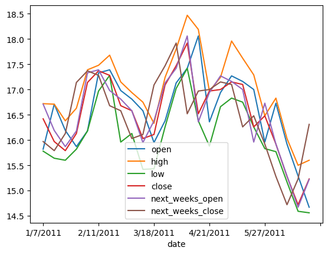

``` python
dfAA[cols2].plot()
```

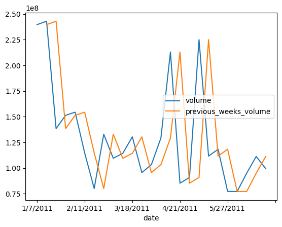

``` python
dfAA[cols3].plot()
```

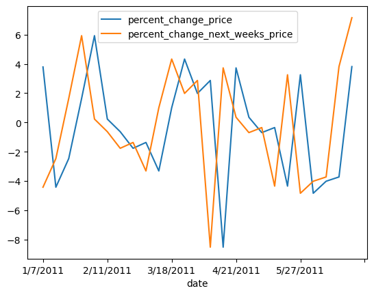

``` python
dfAA[cols4].plot()
```

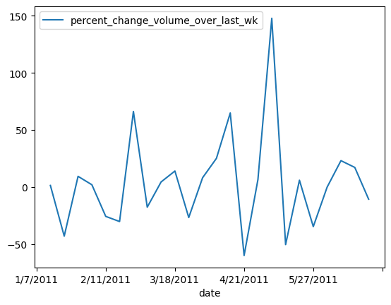

``` python
dfAA[cols5].plot()
```

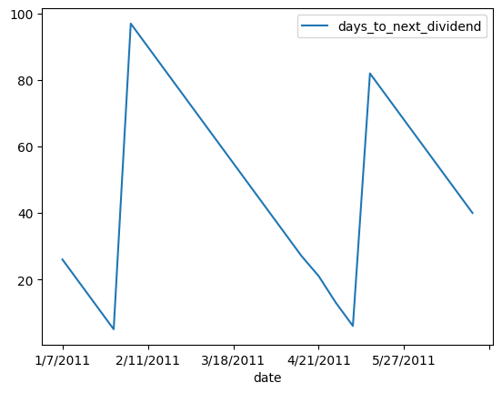

``` python
dfAA[cols6].plot()
```

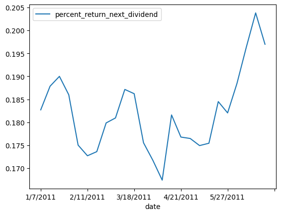

### True: 上がる、False: 下がる

``` python
dfAA["open_updown"] = dfAA["open"] < dfAA["next_weeks_open"]
dfAA["close_updown"] = dfAA["close"] < dfAA["next_weeks_close"]
```

``` python
up = dfAA[dfAA["open_updown"]]
down = dfAA[~dfAA["open_updown"]]
plt.scatter(x = up["high"], y = up["low"])
plt.scatter(x = down["high"], y = down["low"])
```

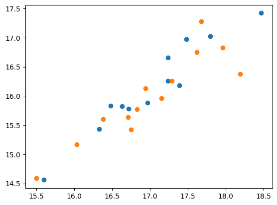

``` python
plt.scatter(x = up[cols3[0]], y = up[cols2[0]])
plt.scatter(x = down[cols3[0]], y = down[cols2[0]])
```

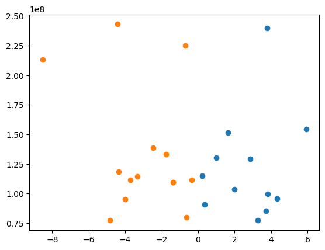

``` python
plt.scatter(x = up[cols6[0]], y = up[cols2[0]])
plt.scatter(x = down[cols6[0]], y = down[cols2[0]])
```

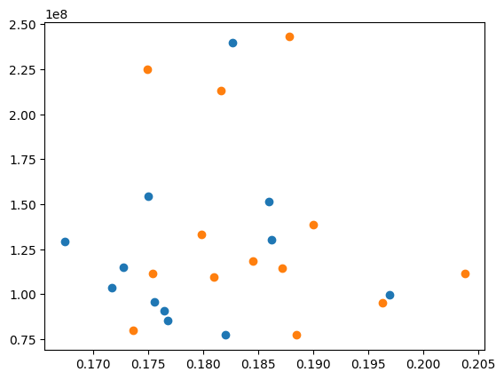

``` python
plt.scatter(x = up[cols6[0]], y = up[cols3[0]])
plt.scatter(x = down[cols6[0]], y = down[cols3[0]])
```

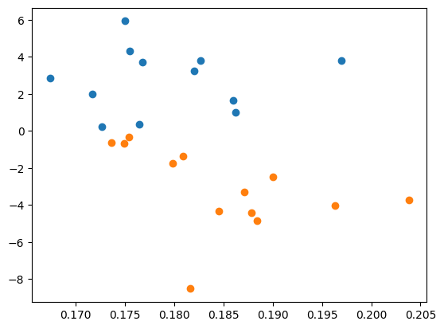

``` python
plt.scatter(x = up[cols4[0]], y = up[cols3[0]])
plt.scatter(x = down[cols4[0]], y = down[cols3[0]])
```

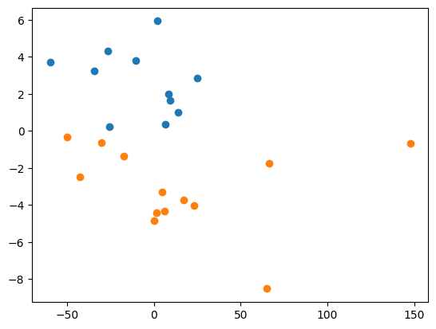

``` python
def load_custom_file(filepath):
    data = []

    with open(filepath, 'r') as f:
        for line in f:
            parts = line.strip().split()
            label = parts[0]  # 最初の数字（ラベル部分）

            # 残りの "番号:値" ペアを辞書に変換
            features = {}
            for item in parts[1:]:
                idx, val = item.split(':')
                features[int(idx)] = float(val)

            # ラベルを追加
            features['label'] = label
            data.append(features)

    # DataFrameに変換（欠けているカラムはNaNで埋める）
    df = pd.DataFrame(data)

    # カラム順を label → feature1, feature2, ...
    cols = ['label'] + sorted([c for c in df.columns if c != 'label'])
    df = df[cols]

    return df
```

``` python
DF = load_custom_file("01_Data/Gas Sensor Array Drift Dataset/batch6.dat")
DF.plot(legend=None)
```


``` python
df = pd.read_csv(
    "01_Data/secom/secom_labels.data",
    sep=r'\s+',
    quotechar='"',
    names=['label', 'timestamp']
)
df['timestamp'] = pd.to_datetime(df['timestamp'], format='%d/%m/%Y %H:%M:%S')
df
```

<div>
<style scoped>
    .dataframe tbody tr th:only-of-type {
        vertical-align: middle;
    }
&#10;    .dataframe tbody tr th {
        vertical-align: top;
    }
&#10;    .dataframe thead th {
        text-align: right;
    }
</style>

<table class="dataframe" data-quarto-postprocess="true" data-border="1">
<thead>
<tr style="text-align: right;">
<th data-quarto-table-cell-role="th"></th>
<th data-quarto-table-cell-role="th">label</th>
<th data-quarto-table-cell-role="th">timestamp</th>
</tr>
</thead>
<tbody>
<tr>
<td data-quarto-table-cell-role="th">0</td>
<td>-1</td>
<td>2008-07-19 11:55:00</td>
</tr>
<tr>
<td data-quarto-table-cell-role="th">1</td>
<td>-1</td>
<td>2008-07-19 12:32:00</td>
</tr>
<tr>
<td data-quarto-table-cell-role="th">2</td>
<td>1</td>
<td>2008-07-19 13:17:00</td>
</tr>
<tr>
<td data-quarto-table-cell-role="th">3</td>
<td>-1</td>
<td>2008-07-19 14:43:00</td>
</tr>
<tr>
<td data-quarto-table-cell-role="th">4</td>
<td>-1</td>
<td>2008-07-19 15:22:00</td>
</tr>
<tr>
<td data-quarto-table-cell-role="th">...</td>
<td>...</td>
<td>...</td>
</tr>
<tr>
<td data-quarto-table-cell-role="th">1562</td>
<td>-1</td>
<td>2008-10-16 15:13:00</td>
</tr>
<tr>
<td data-quarto-table-cell-role="th">1563</td>
<td>-1</td>
<td>2008-10-16 20:49:00</td>
</tr>
<tr>
<td data-quarto-table-cell-role="th">1564</td>
<td>-1</td>
<td>2008-10-17 05:26:00</td>
</tr>
<tr>
<td data-quarto-table-cell-role="th">1565</td>
<td>-1</td>
<td>2008-10-17 06:01:00</td>
</tr>
<tr>
<td data-quarto-table-cell-role="th">1566</td>
<td>-1</td>
<td>2008-10-17 06:07:00</td>
</tr>
</tbody>
</table>

<p>1567 rows × 2 columns</p>
</div>

``` python
df1 = pd.read_csv("01_Data/secom/secom.data", sep=r'\s+', header=None)
df1
```

<div>
<style scoped>
    .dataframe tbody tr th:only-of-type {
        vertical-align: middle;
    }
&#10;    .dataframe tbody tr th {
        vertical-align: top;
    }
&#10;    .dataframe thead th {
        text-align: right;
    }
</style>

<table class="dataframe" data-quarto-postprocess="true" data-border="1">
<thead>
<tr style="text-align: right;">
<th data-quarto-table-cell-role="th"></th>
<th data-quarto-table-cell-role="th">0</th>
<th data-quarto-table-cell-role="th">1</th>
<th data-quarto-table-cell-role="th">2</th>
<th data-quarto-table-cell-role="th">3</th>
<th data-quarto-table-cell-role="th">4</th>
<th data-quarto-table-cell-role="th">5</th>
<th data-quarto-table-cell-role="th">6</th>
<th data-quarto-table-cell-role="th">7</th>
<th data-quarto-table-cell-role="th">8</th>
<th data-quarto-table-cell-role="th">9</th>
<th data-quarto-table-cell-role="th">...</th>
<th data-quarto-table-cell-role="th">580</th>
<th data-quarto-table-cell-role="th">581</th>
<th data-quarto-table-cell-role="th">582</th>
<th data-quarto-table-cell-role="th">583</th>
<th data-quarto-table-cell-role="th">584</th>
<th data-quarto-table-cell-role="th">585</th>
<th data-quarto-table-cell-role="th">586</th>
<th data-quarto-table-cell-role="th">587</th>
<th data-quarto-table-cell-role="th">588</th>
<th data-quarto-table-cell-role="th">589</th>
</tr>
</thead>
<tbody>
<tr>
<td data-quarto-table-cell-role="th">0</td>
<td>3030.93</td>
<td>2564.00</td>
<td>2187.7333</td>
<td>1411.1265</td>
<td>1.3602</td>
<td>100.0</td>
<td>97.6133</td>
<td>0.1242</td>
<td>1.5005</td>
<td>0.0162</td>
<td>...</td>
<td>NaN</td>
<td>NaN</td>
<td>0.5005</td>
<td>0.0118</td>
<td>0.0035</td>
<td>2.3630</td>
<td>NaN</td>
<td>NaN</td>
<td>NaN</td>
<td>NaN</td>
</tr>
<tr>
<td data-quarto-table-cell-role="th">1</td>
<td>3095.78</td>
<td>2465.14</td>
<td>2230.4222</td>
<td>1463.6606</td>
<td>0.8294</td>
<td>100.0</td>
<td>102.3433</td>
<td>0.1247</td>
<td>1.4966</td>
<td>-0.0005</td>
<td>...</td>
<td>0.0060</td>
<td>208.2045</td>
<td>0.5019</td>
<td>0.0223</td>
<td>0.0055</td>
<td>4.4447</td>
<td>0.0096</td>
<td>0.0201</td>
<td>0.0060</td>
<td>208.2045</td>
</tr>
<tr>
<td data-quarto-table-cell-role="th">2</td>
<td>2932.61</td>
<td>2559.94</td>
<td>2186.4111</td>
<td>1698.0172</td>
<td>1.5102</td>
<td>100.0</td>
<td>95.4878</td>
<td>0.1241</td>
<td>1.4436</td>
<td>0.0041</td>
<td>...</td>
<td>0.0148</td>
<td>82.8602</td>
<td>0.4958</td>
<td>0.0157</td>
<td>0.0039</td>
<td>3.1745</td>
<td>0.0584</td>
<td>0.0484</td>
<td>0.0148</td>
<td>82.8602</td>
</tr>
<tr>
<td data-quarto-table-cell-role="th">3</td>
<td>2988.72</td>
<td>2479.90</td>
<td>2199.0333</td>
<td>909.7926</td>
<td>1.3204</td>
<td>100.0</td>
<td>104.2367</td>
<td>0.1217</td>
<td>1.4882</td>
<td>-0.0124</td>
<td>...</td>
<td>0.0044</td>
<td>73.8432</td>
<td>0.4990</td>
<td>0.0103</td>
<td>0.0025</td>
<td>2.0544</td>
<td>0.0202</td>
<td>0.0149</td>
<td>0.0044</td>
<td>73.8432</td>
</tr>
<tr>
<td data-quarto-table-cell-role="th">4</td>
<td>3032.24</td>
<td>2502.87</td>
<td>2233.3667</td>
<td>1326.5200</td>
<td>1.5334</td>
<td>100.0</td>
<td>100.3967</td>
<td>0.1235</td>
<td>1.5031</td>
<td>-0.0031</td>
<td>...</td>
<td>NaN</td>
<td>NaN</td>
<td>0.4800</td>
<td>0.4766</td>
<td>0.1045</td>
<td>99.3032</td>
<td>0.0202</td>
<td>0.0149</td>
<td>0.0044</td>
<td>73.8432</td>
</tr>
<tr>
<td data-quarto-table-cell-role="th">...</td>
<td>...</td>
<td>...</td>
<td>...</td>
<td>...</td>
<td>...</td>
<td>...</td>
<td>...</td>
<td>...</td>
<td>...</td>
<td>...</td>
<td>...</td>
<td>...</td>
<td>...</td>
<td>...</td>
<td>...</td>
<td>...</td>
<td>...</td>
<td>...</td>
<td>...</td>
<td>...</td>
<td>...</td>
</tr>
<tr>
<td data-quarto-table-cell-role="th">1562</td>
<td>2899.41</td>
<td>2464.36</td>
<td>2179.7333</td>
<td>3085.3781</td>
<td>1.4843</td>
<td>100.0</td>
<td>82.2467</td>
<td>0.1248</td>
<td>1.3424</td>
<td>-0.0045</td>
<td>...</td>
<td>0.0047</td>
<td>203.1720</td>
<td>0.4988</td>
<td>0.0143</td>
<td>0.0039</td>
<td>2.8669</td>
<td>0.0068</td>
<td>0.0138</td>
<td>0.0047</td>
<td>203.1720</td>
</tr>
<tr>
<td data-quarto-table-cell-role="th">1563</td>
<td>3052.31</td>
<td>2522.55</td>
<td>2198.5667</td>
<td>1124.6595</td>
<td>0.8763</td>
<td>100.0</td>
<td>98.4689</td>
<td>0.1205</td>
<td>1.4333</td>
<td>-0.0061</td>
<td>...</td>
<td>NaN</td>
<td>NaN</td>
<td>0.4975</td>
<td>0.0131</td>
<td>0.0036</td>
<td>2.6238</td>
<td>0.0068</td>
<td>0.0138</td>
<td>0.0047</td>
<td>203.1720</td>
</tr>
<tr>
<td data-quarto-table-cell-role="th">1564</td>
<td>2978.81</td>
<td>2379.78</td>
<td>2206.3000</td>
<td>1110.4967</td>
<td>0.8236</td>
<td>100.0</td>
<td>99.4122</td>
<td>0.1208</td>
<td>NaN</td>
<td>NaN</td>
<td>...</td>
<td>0.0025</td>
<td>43.5231</td>
<td>0.4987</td>
<td>0.0153</td>
<td>0.0041</td>
<td>3.0590</td>
<td>0.0197</td>
<td>0.0086</td>
<td>0.0025</td>
<td>43.5231</td>
</tr>
<tr>
<td data-quarto-table-cell-role="th">1565</td>
<td>2894.92</td>
<td>2532.01</td>
<td>2177.0333</td>
<td>1183.7287</td>
<td>1.5726</td>
<td>100.0</td>
<td>98.7978</td>
<td>0.1213</td>
<td>1.4622</td>
<td>-0.0072</td>
<td>...</td>
<td>0.0075</td>
<td>93.4941</td>
<td>0.5004</td>
<td>0.0178</td>
<td>0.0038</td>
<td>3.5662</td>
<td>0.0262</td>
<td>0.0245</td>
<td>0.0075</td>
<td>93.4941</td>
</tr>
<tr>
<td data-quarto-table-cell-role="th">1566</td>
<td>2944.92</td>
<td>2450.76</td>
<td>2195.4444</td>
<td>2914.1792</td>
<td>1.5978</td>
<td>100.0</td>
<td>85.1011</td>
<td>0.1235</td>
<td>NaN</td>
<td>NaN</td>
<td>...</td>
<td>0.0045</td>
<td>137.7844</td>
<td>0.4987</td>
<td>0.0181</td>
<td>0.0040</td>
<td>3.6275</td>
<td>0.0117</td>
<td>0.0162</td>
<td>0.0045</td>
<td>137.7844</td>
</tr>
</tbody>
</table>

<p>1567 rows × 590 columns</p>
</div>
