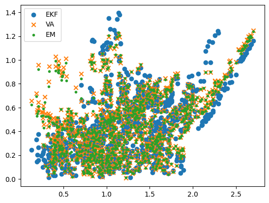
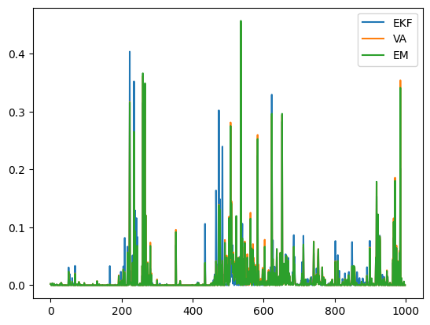

# 評価


<!-- WARNING: THIS FILE WAS AUTOGENERATED! DO NOT EDIT! -->

``` python
N = 2
G = 1/2**8 * jnp.identity(N, dtype=jnp.float32)
Sigma = 5.0 * jnp.identity(N, dtype=jnp.float32)
w0 = jnp.ones((N,), dtype=jnp.float32)/jnp.sqrt(N)
propy1 = 0.5

W_norm, RMS_Wtt_EKF, RMS_Wtt_VA, RMS_Wtt_EM = RMS(
  key=jrd.PRNGKey(0), 
  N=2, 
  T=1000, 
  G=G,
  w0=w0,
  Sigma=Sigma,
  P0=G,
  propy1=propy1)
```

``` python
plt.scatter(W_norm, RMS_Wtt_EKF, label="EKF")
plt.scatter(W_norm, RMS_Wtt_VA, marker='x', label="VA")
plt.scatter(W_norm, RMS_Wtt_EM, marker='.', label="EM")
plt.legend()
```



``` python
N = 2
G = 1/2**8 * jnp.identity(N, dtype=jnp.float32)
Sigma = 5.0 * jnp.identity(N, dtype=jnp.float32)
w0 = jnp.ones((N,), dtype=jnp.float32)/jnp.sqrt(N)
propy1 = 0.5

RMS_Wtt_EKF, RMS_Wtt_VA, RMS_Wtt_EM = losi_error(
  key=jrd.PRNGKey(0), 
  N=2, 
  T=1000, 
  G=G,
  w0=w0,
  Sigma=Sigma,
  P0=G,
  propy1=propy1)
```

``` python
plt.plot(RMS_Wtt_EKF, label="EKF")
plt.plot(RMS_Wtt_VA, label="VA")
plt.plot(RMS_Wtt_EM, label="EM")
plt.legend()
```



``` python
sum(RMS_Wtt_EKF), sum(RMS_Wtt_VA), sum(RMS_Wtt_EM)
```

    (Array(10.609799, dtype=float32),
     Array(11.298924, dtype=float32),
     Array(11.056256, dtype=float32))

``` python
jnp.array([1,2,3])[:-1]
```

    Array([1, 2], dtype=int32)
