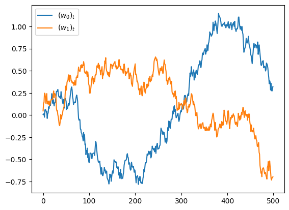
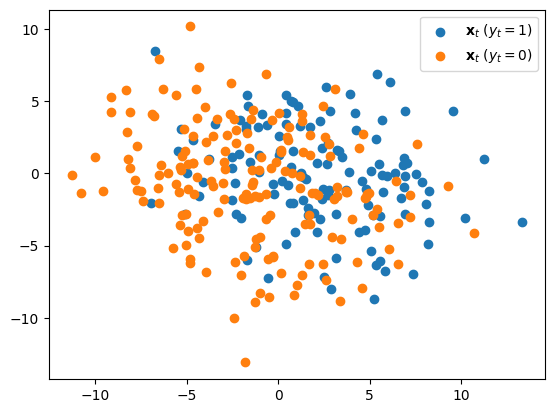
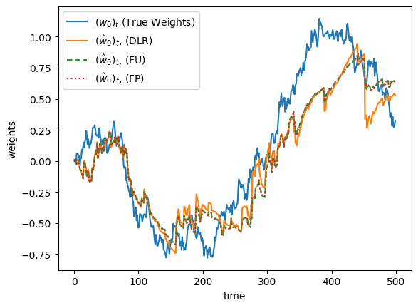
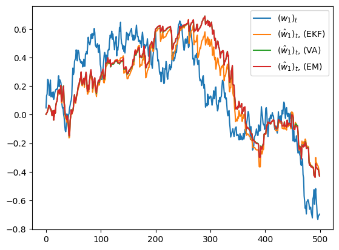
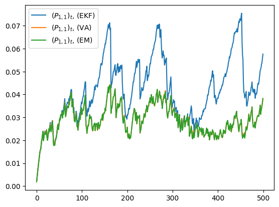
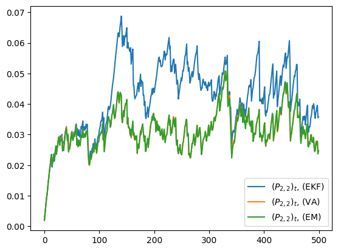
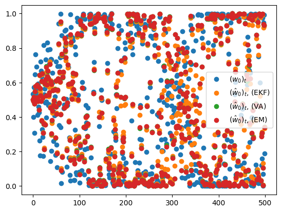
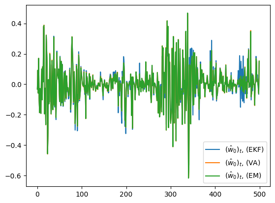

# 実験


<!-- WARNING: THIS FILE WAS AUTOGENERATED! DO NOT EDIT! -->

``` python
N=2
G = 1/2**9 * jnp.identity(N, dtype=jnp.float32)
Sigma = 10* jnp.identity(N, dtype=jnp.float32)
w0 = 0*jnp.ones((N,), dtype=jnp.float32)
propy1 = 0.5

X, Y, W, \
  (Wtt_EKF, Ptt_EKF), \
    (Wtt_VA, Ptt_VA, Xit_VA), \
      (Wtt_EM, Ptt_EM, Xit_EM) \
        = exper(
  key=jrd.PRNGKey(422), # 822 522
  N=N, 
  T=500, 
  G=G,
  w0=w0,
  Sigma=Sigma,
  P0=G,
  propy1=propy1)
```

``` python
plt.plot(W[:,0], label=r"$(w_0)_t$")
plt.plot(W[:,1], label=r"$(w_1)_t$")
plt.legend()
```



``` python
plt.scatter(X[Y==1][100:300,0], X[Y==1][100:300,1], label=r"$\mathbf{x}_t\ (y_t=1)$")
plt.scatter(X[Y==0][100:300,0], X[Y==0][100:300,1], label=r"$\mathbf{x}_t\ (y_t=0)$")
plt.legend()
```



``` python
plt.plot(W[:,0], label=r"$(w_0)_t$ (True Weights)")
plt.plot(Wtt_EKF[:,0], "-", label=r"$(\hat{w}_0)_t$, (DLR)")
plt.plot(Wtt_VA[:,0], "--", label=r"$(\hat{w}_0)_t$, (FU)")
plt.plot(Wtt_EM[:,0], ":", label=r"$(\hat{w}_0)_t$, (FP)")
plt.xlabel("time")
plt.ylabel("weights")
plt.legend()
```



``` python
plt.plot(W[:,1], label=r"$(w_1)_t$")
plt.plot(Wtt_EKF[:,1], label=r"$(\hat{w}_1)_t$, (EKF)")
plt.plot(Wtt_VA[:,1], label=r"$(\hat{w}_1)_t$, (VA)")
plt.plot(Wtt_EM[:,1], label=r"$(\hat{w}_1)_t$, (EM)")
plt.legend()
```



``` python
plt.plot(Ptt_EKF[:,0,0], label=r"$(P_{1,1})_t$, (EKF)")
plt.plot(Ptt_VA[:,0,0], label=r"$(P_{1,1})_t$, (VA)")
plt.plot(Ptt_EM[:,0,0], label=r"$(P_{1,1})_t$, (EM)")
plt.legend()
```



``` python
plt.plot(Ptt_EKF[:,1,1], label=r"$(P_{2,2})_t$, (EKF)")
plt.plot(Ptt_VA[:,1,1], label=r"$(P_{2,2})_t$, (VA)")
plt.plot(Ptt_EM[:,1,1], label=r"$(P_{2,2})_t$, (EM)")
plt.legend()
```



``` python
plt.plot(simple.losi(jnp.sum(W*X, axis=1)), 'o', label=r"$(w_0)_t$")
plt.plot(simple.losi(jnp.sum(Wtt_EKF*X, axis=1)), 'o', label=r"$(\hat{w}_0)_t$, (EKF)")
plt.plot(simple.losi(jnp.sum(Wtt_VA*X, axis=1)), 'o', label=r"$(\hat{w}_0)_t$, (VA)")
plt.plot(simple.losi(jnp.sum(Wtt_EM*X, axis=1)), 'o', label=r"$(\hat{w}_0)_t$, (EM)")
plt.legend()
```



``` python
true_line = simple.losi(jnp.sum(W*X, axis=1))
plt.plot(simple.losi(jnp.sum(Wtt_EKF*X, axis=1)) - true_line, label=r"$(\hat{w}_0)_t$, (EKF)")
plt.plot(simple.losi(jnp.sum(Wtt_VA*X, axis=1)) - true_line, label=r"$(\hat{w}_0)_t$, (VA)")
plt.plot(simple.losi(jnp.sum(Wtt_EM*X, axis=1)) - true_line, label=r"$(\hat{w}_0)_t$, (EM)")
plt.legend()
```



``` python
print(jnp.sum((simple.losi(jnp.sum(Wtt_EKF*X, axis=1)) - true_line)**2))
print(jnp.sum((simple.losi(jnp.sum(Wtt_VA*X, axis=1)) - true_line)**2))
print(jnp.sum((simple.losi(jnp.sum(Wtt_EM*X, axis=1)) - true_line)**2))
```

    7.2249694
    7.6888556
    7.6575623

``` python
import pandas as pd
```

``` python
df1 = pd.read_csv("data.csv", sep="\t")
df1
```

<div>
<style scoped>
    .dataframe tbody tr th:only-of-type {
        vertical-align: middle;
    }
&#10;    .dataframe tbody tr th {
        vertical-align: top;
    }
&#10;    .dataframe thead th {
        text-align: right;
    }
</style>

<table class="dataframe" data-quarto-postprocess="true" data-border="1">
<thead>
<tr style="text-align: right;">
<th data-quarto-table-cell-role="th"></th>
<th data-quarto-table-cell-role="th">N</th>
<th data-quarto-table-cell-role="th">G</th>
<th data-quarto-table-cell-role="th">Sigma</th>
<th data-quarto-table-cell-role="th">propy1</th>
<th data-quarto-table-cell-role="th">err_EKF_sc</th>
<th data-quarto-table-cell-role="th">err_VA_sc</th>
<th data-quarto-table-cell-role="th">err_EM_sc</th>
</tr>
</thead>
<tbody>
<tr>
<td data-quarto-table-cell-role="th">2</td>
<td>2.0</td>
<td>0.062500</td>
<td>0.50</td>
<td>0.5</td>
<td>0.093420</td>
<td>0.093336</td>
<td>0.093043</td>
</tr>
<tr>
<td data-quarto-table-cell-role="th">4</td>
<td>2.0</td>
<td>0.062500</td>
<td>1.00</td>
<td>0.5</td>
<td>0.093443</td>
<td>0.091697</td>
<td>0.091294</td>
</tr>
<tr>
<td data-quarto-table-cell-role="th">6</td>
<td>2.0</td>
<td>0.062500</td>
<td>2.00</td>
<td>0.5</td>
<td>0.093836</td>
<td>0.089228</td>
<td>0.088805</td>
</tr>
<tr>
<td data-quarto-table-cell-role="th">8</td>
<td>2.0</td>
<td>0.062500</td>
<td>4.00</td>
<td>0.5</td>
<td>0.094327</td>
<td>0.086147</td>
<td>0.085870</td>
</tr>
<tr>
<td data-quarto-table-cell-role="th">10</td>
<td>2.0</td>
<td>0.062500</td>
<td>8.00</td>
<td>0.5</td>
<td>0.096139</td>
<td>0.082455</td>
<td>0.082723</td>
</tr>
<tr>
<td data-quarto-table-cell-role="th">18</td>
<td>2.0</td>
<td>0.015625</td>
<td>2.00</td>
<td>0.5</td>
<td>0.093420</td>
<td>0.093336</td>
<td>0.093043</td>
</tr>
<tr>
<td data-quarto-table-cell-role="th">20</td>
<td>2.0</td>
<td>0.015625</td>
<td>4.00</td>
<td>0.5</td>
<td>0.093443</td>
<td>0.091697</td>
<td>0.091294</td>
</tr>
<tr>
<td data-quarto-table-cell-role="th">22</td>
<td>2.0</td>
<td>0.015625</td>
<td>8.00</td>
<td>0.5</td>
<td>0.093836</td>
<td>0.089228</td>
<td>0.088805</td>
</tr>
<tr>
<td data-quarto-table-cell-role="th">34</td>
<td>2.0</td>
<td>0.003906</td>
<td>8.00</td>
<td>0.5</td>
<td>0.093420</td>
<td>0.093336</td>
<td>0.093043</td>
</tr>
<tr>
<td data-quarto-table-cell-role="th">48</td>
<td>2.0</td>
<td>0.000244</td>
<td>0.25</td>
<td>0.5</td>
<td>0.039164</td>
<td>0.039163</td>
<td>0.039163</td>
</tr>
<tr>
<td data-quarto-table-cell-role="th">60</td>
<td>4.0</td>
<td>0.062500</td>
<td>0.25</td>
<td>0.5</td>
<td>0.100617</td>
<td>0.099913</td>
<td>0.099700</td>
</tr>
<tr>
<td data-quarto-table-cell-role="th">62</td>
<td>4.0</td>
<td>0.062500</td>
<td>0.50</td>
<td>0.5</td>
<td>0.093656</td>
<td>0.091329</td>
<td>0.091214</td>
</tr>
<tr>
<td data-quarto-table-cell-role="th">64</td>
<td>4.0</td>
<td>0.062500</td>
<td>1.00</td>
<td>0.5</td>
<td>0.085952</td>
<td>0.080761</td>
<td>0.080898</td>
</tr>
<tr>
<td data-quarto-table-cell-role="th">66</td>
<td>4.0</td>
<td>0.062500</td>
<td>2.00</td>
<td>0.5</td>
<td>0.078222</td>
<td>0.070136</td>
<td>0.070658</td>
</tr>
<tr>
<td data-quarto-table-cell-role="th">68</td>
<td>4.0</td>
<td>0.062500</td>
<td>4.00</td>
<td>0.5</td>
<td>0.072354</td>
<td>0.060668</td>
<td>0.061745</td>
</tr>
<tr>
<td data-quarto-table-cell-role="th">70</td>
<td>4.0</td>
<td>0.062500</td>
<td>8.00</td>
<td>0.5</td>
<td>0.064038</td>
<td>0.051949</td>
<td>0.053414</td>
</tr>
<tr>
<td data-quarto-table-cell-role="th">76</td>
<td>4.0</td>
<td>0.015625</td>
<td>1.00</td>
<td>0.5</td>
<td>0.100617</td>
<td>0.099913</td>
<td>0.099700</td>
</tr>
<tr>
<td data-quarto-table-cell-role="th">78</td>
<td>4.0</td>
<td>0.015625</td>
<td>2.00</td>
<td>0.5</td>
<td>0.093656</td>
<td>0.091329</td>
<td>0.091214</td>
</tr>
<tr>
<td data-quarto-table-cell-role="th">80</td>
<td>4.0</td>
<td>0.015625</td>
<td>4.00</td>
<td>0.5</td>
<td>0.085952</td>
<td>0.080761</td>
<td>0.080898</td>
</tr>
<tr>
<td data-quarto-table-cell-role="th">82</td>
<td>4.0</td>
<td>0.015625</td>
<td>8.00</td>
<td>0.5</td>
<td>0.078222</td>
<td>0.070136</td>
<td>0.070658</td>
</tr>
<tr>
<td data-quarto-table-cell-role="th">92</td>
<td>4.0</td>
<td>0.003906</td>
<td>4.00</td>
<td>0.5</td>
<td>0.100617</td>
<td>0.099913</td>
<td>0.099700</td>
</tr>
<tr>
<td data-quarto-table-cell-role="th">94</td>
<td>4.0</td>
<td>0.003906</td>
<td>8.00</td>
<td>0.5</td>
<td>0.093656</td>
<td>0.091329</td>
<td>0.091214</td>
</tr>
<tr>
<td data-quarto-table-cell-role="th">120</td>
<td>8.0</td>
<td>0.062500</td>
<td>0.25</td>
<td>0.5</td>
<td>0.096732</td>
<td>0.091938</td>
<td>0.092006</td>
</tr>
<tr>
<td data-quarto-table-cell-role="th">122</td>
<td>8.0</td>
<td>0.062500</td>
<td>0.50</td>
<td>0.5</td>
<td>0.083484</td>
<td>0.076024</td>
<td>0.076319</td>
</tr>
<tr>
<td data-quarto-table-cell-role="th">124</td>
<td>8.0</td>
<td>0.062500</td>
<td>1.00</td>
<td>0.5</td>
<td>0.071028</td>
<td>0.062117</td>
<td>0.062546</td>
</tr>
<tr>
<td data-quarto-table-cell-role="th">126</td>
<td>8.0</td>
<td>0.062500</td>
<td>2.00</td>
<td>0.5</td>
<td>0.059638</td>
<td>0.050017</td>
<td>0.050485</td>
</tr>
<tr>
<td data-quarto-table-cell-role="th">128</td>
<td>8.0</td>
<td>0.062500</td>
<td>4.00</td>
<td>0.5</td>
<td>0.048867</td>
<td>0.039920</td>
<td>0.040344</td>
</tr>
<tr>
<td data-quarto-table-cell-role="th">130</td>
<td>8.0</td>
<td>0.062500</td>
<td>8.00</td>
<td>0.5</td>
<td>0.038852</td>
<td>0.031403</td>
<td>0.031772</td>
</tr>
<tr>
<td data-quarto-table-cell-role="th">132</td>
<td>8.0</td>
<td>0.015625</td>
<td>0.25</td>
<td>0.5</td>
<td>0.120174</td>
<td>0.119479</td>
<td>0.119283</td>
</tr>
<tr>
<td data-quarto-table-cell-role="th">134</td>
<td>8.0</td>
<td>0.015625</td>
<td>0.50</td>
<td>0.5</td>
<td>0.109672</td>
<td>0.107326</td>
<td>0.107210</td>
</tr>
<tr>
<td data-quarto-table-cell-role="th">136</td>
<td>8.0</td>
<td>0.015625</td>
<td>1.00</td>
<td>0.5</td>
<td>0.096732</td>
<td>0.091938</td>
<td>0.092006</td>
</tr>
<tr>
<td data-quarto-table-cell-role="th">138</td>
<td>8.0</td>
<td>0.015625</td>
<td>2.00</td>
<td>0.5</td>
<td>0.083484</td>
<td>0.076024</td>
<td>0.076319</td>
</tr>
<tr>
<td data-quarto-table-cell-role="th">140</td>
<td>8.0</td>
<td>0.015625</td>
<td>4.00</td>
<td>0.5</td>
<td>0.071028</td>
<td>0.062117</td>
<td>0.062546</td>
</tr>
<tr>
<td data-quarto-table-cell-role="th">142</td>
<td>8.0</td>
<td>0.015625</td>
<td>8.00</td>
<td>0.5</td>
<td>0.059638</td>
<td>0.050017</td>
<td>0.050485</td>
</tr>
<tr>
<td data-quarto-table-cell-role="th">146</td>
<td>8.0</td>
<td>0.003906</td>
<td>0.50</td>
<td>0.5</td>
<td>0.125066</td>
<td>0.124960</td>
<td>0.124792</td>
</tr>
<tr>
<td data-quarto-table-cell-role="th">148</td>
<td>8.0</td>
<td>0.003906</td>
<td>1.00</td>
<td>0.5</td>
<td>0.120174</td>
<td>0.119479</td>
<td>0.119283</td>
</tr>
<tr>
<td data-quarto-table-cell-role="th">150</td>
<td>8.0</td>
<td>0.003906</td>
<td>2.00</td>
<td>0.5</td>
<td>0.109672</td>
<td>0.107326</td>
<td>0.107210</td>
</tr>
<tr>
<td data-quarto-table-cell-role="th">152</td>
<td>8.0</td>
<td>0.003906</td>
<td>4.00</td>
<td>0.5</td>
<td>0.096732</td>
<td>0.091938</td>
<td>0.092006</td>
</tr>
<tr>
<td data-quarto-table-cell-role="th">154</td>
<td>8.0</td>
<td>0.003906</td>
<td>8.00</td>
<td>0.5</td>
<td>0.083484</td>
<td>0.076024</td>
<td>0.076319</td>
</tr>
<tr>
<td data-quarto-table-cell-role="th">156</td>
<td>8.0</td>
<td>0.000977</td>
<td>0.25</td>
<td>0.5</td>
<td>0.104002</td>
<td>0.103998</td>
<td>0.103986</td>
</tr>
<tr>
<td data-quarto-table-cell-role="th">162</td>
<td>8.0</td>
<td>0.000977</td>
<td>2.00</td>
<td>0.5</td>
<td>0.125066</td>
<td>0.124960</td>
<td>0.124792</td>
</tr>
<tr>
<td data-quarto-table-cell-role="th">164</td>
<td>8.0</td>
<td>0.000977</td>
<td>4.00</td>
<td>0.5</td>
<td>0.120174</td>
<td>0.119479</td>
<td>0.119283</td>
</tr>
<tr>
<td data-quarto-table-cell-role="th">166</td>
<td>8.0</td>
<td>0.000977</td>
<td>8.00</td>
<td>0.5</td>
<td>0.109672</td>
<td>0.107326</td>
<td>0.107210</td>
</tr>
<tr>
<td data-quarto-table-cell-role="th">168</td>
<td>8.0</td>
<td>0.000244</td>
<td>0.25</td>
<td>0.5</td>
<td>0.076621</td>
<td>0.076618</td>
<td>0.076616</td>
</tr>
<tr>
<td data-quarto-table-cell-role="th">170</td>
<td>8.0</td>
<td>0.000244</td>
<td>0.50</td>
<td>0.5</td>
<td>0.090635</td>
<td>0.090629</td>
<td>0.090625</td>
</tr>
<tr>
<td data-quarto-table-cell-role="th">172</td>
<td>8.0</td>
<td>0.000244</td>
<td>1.00</td>
<td>0.5</td>
<td>0.104002</td>
<td>0.103998</td>
<td>0.103986</td>
</tr>
<tr>
<td data-quarto-table-cell-role="th">178</td>
<td>8.0</td>
<td>0.000244</td>
<td>8.00</td>
<td>0.5</td>
<td>0.125066</td>
<td>0.124960</td>
<td>0.124792</td>
</tr>
</tbody>
</table>

</div>

``` python
df1[(df1["err_EKF_sc"] < df1["err_VA_sc"])].groupby("N").count()
```

<div>
<style scoped>
    .dataframe tbody tr th:only-of-type {
        vertical-align: middle;
    }
&#10;    .dataframe tbody tr th {
        vertical-align: top;
    }
&#10;    .dataframe thead th {
        text-align: right;
    }
</style>

<table class="dataframe" data-quarto-postprocess="true" data-border="1">
<thead>
<tr style="text-align: right;">
<th data-quarto-table-cell-role="th"></th>
<th data-quarto-table-cell-role="th">G</th>
<th data-quarto-table-cell-role="th">Sigma</th>
<th data-quarto-table-cell-role="th">propy1</th>
<th data-quarto-table-cell-role="th">err_EKF_sc</th>
<th data-quarto-table-cell-role="th">err_VA_sc</th>
<th data-quarto-table-cell-role="th">err_EM_sc</th>
</tr>
<tr>
<th data-quarto-table-cell-role="th">N</th>
<th data-quarto-table-cell-role="th"></th>
<th data-quarto-table-cell-role="th"></th>
<th data-quarto-table-cell-role="th"></th>
<th data-quarto-table-cell-role="th"></th>
<th data-quarto-table-cell-role="th"></th>
<th data-quarto-table-cell-role="th"></th>
</tr>
</thead>
<tbody>
</tbody>
</table>

</div>

``` python
df1["err_EKF_sc"] > df1["err_VA_sc"]
```

    2      True
    4      True
    6      True
    8      True
    10     True
    18     True
    20     True
    22     True
    34     True
    48     True
    60     True
    62     True
    64     True
    66     True
    68     True
    70     True
    76     True
    78     True
    80     True
    82     True
    92     True
    94     True
    120    True
    122    True
    124    True
    126    True
    128    True
    130    True
    132    True
    134    True
    136    True
    138    True
    140    True
    142    True
    146    True
    148    True
    150    True
    152    True
    154    True
    156    True
    162    True
    164    True
    166    True
    168    True
    170    True
    172    True
    178    True
    dtype: bool
