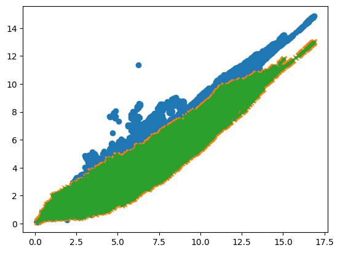
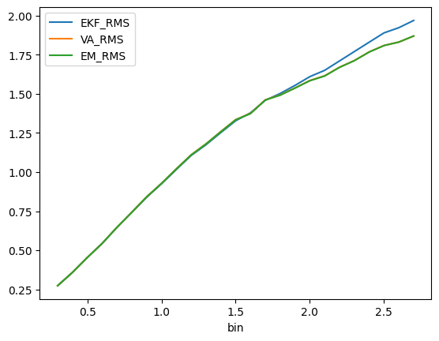
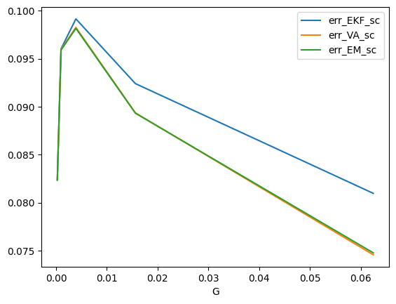
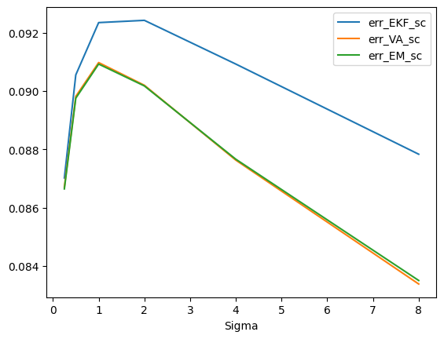
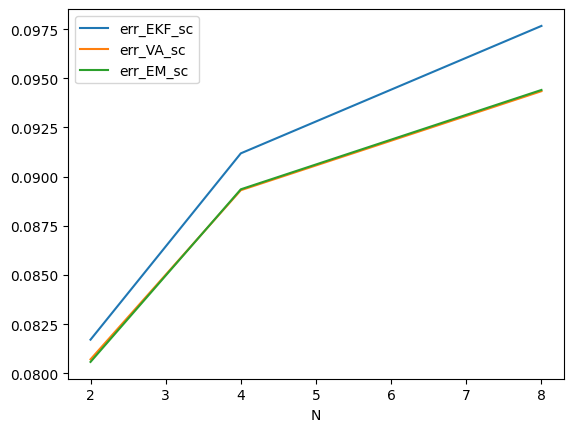

# key によるバッチ化


<!-- WARNING: THIS FILE WAS AUTOGENERATED! DO NOT EDIT! -->

``` python
---
skip_showdoc: true
---
```

``` python
N=2
T=1000 
G =  1/2**7 * jnp.identity(N, dtype=jnp.float32)
Sigma = 1.5 * jnp.identity(N, dtype=jnp.float32)
w0 = 0*jnp.ones((N,), dtype=jnp.float32)/jnp.sqrt(N)
P0 = G
propy1 = 0.5

batched_exper = jax.vmap(
  lambda key: Comp.RMS(key, N, T, G, w0, Sigma, P0, propy1)
)

master_key = jrd.PRNGKey(0)
keys = jrd.split(master_key, 1000)

W_norms, RMS_EKF, RMS_VA, RMS_EM = batched_exper(keys)
```

``` python
plt.scatter(W_norms.reshape(-1), RMS_EKF.reshape(-1))
plt.scatter(W_norms.reshape(-1), RMS_VA.reshape(-1), marker="x")
plt.scatter(W_norms.reshape(-1), RMS_EM.reshape(-1), marker=".")
```



``` python
# bin の定義
bins = jnp.arange(0.1, 12, 0.1)
bin_edges = jnp.arange(0.0, 12.1, 0.1)  # 例: [0.0, 0.1, 0.2, ..., 12.0]

# 各要素が属するビンを計算 (1~len(bins) のインデックス)
bin_idx = jnp.digitize(W_norms.ravel(), bin_edges) - 1  # shape (T*N,)

# フラット化
ekf_flat = RMS_EKF.ravel()
va_flat  = RMS_VA.ravel()
em_flat = RMS_EM.ravel()

# 各 bin ごとの総和とカウントを計算
sum_ekf = jnp.bincount(bin_idx, weights=ekf_flat, length=len(bins))
sum_va  = jnp.bincount(bin_idx, weights=va_flat,  length=len(bins))
sum_em  = jnp.bincount(bin_idx, weights=em_flat,  length=len(bins))
counts  = jnp.bincount(bin_idx, length=len(bins))

# 平均を計算（ゼロ除算防止）
mean_ekf = jnp.where(counts > 0, sum_ekf / counts, jnp.nan)
mean_va  = jnp.where(counts > 0, sum_va / counts, jnp.nan)
mean_em  = jnp.where(counts > 0, sum_em / counts, jnp.nan)

# 最終結果をまとめる
df_source = jnp.stack([bins, mean_ekf, mean_va, mean_em], axis=1)

# Pandas DataFrame に変換（必要なら）
df = pd.DataFrame(jnp.array(df_source), columns=["bin", "EKF_RMS", "VA_RMS", "EM_RMS"]).set_index("bin")
```

``` python
df[0.8:10].head(20)
```

<div>
<style scoped>
    .dataframe tbody tr th:only-of-type {
        vertical-align: middle;
    }
&#10;    .dataframe tbody tr th {
        vertical-align: top;
    }
&#10;    .dataframe thead th {
        text-align: right;
    }
</style>

<table class="dataframe" data-quarto-postprocess="true" data-border="1">
<thead>
<tr style="text-align: right;">
<th data-quarto-table-cell-role="th"></th>
<th data-quarto-table-cell-role="th">EKF_RMS</th>
<th data-quarto-table-cell-role="th">VA_RMS</th>
<th data-quarto-table-cell-role="th">EM_RMS</th>
</tr>
<tr>
<th data-quarto-table-cell-role="th">bin</th>
<th data-quarto-table-cell-role="th"></th>
<th data-quarto-table-cell-role="th"></th>
<th data-quarto-table-cell-role="th"></th>
</tr>
</thead>
<tbody>
<tr>
<td data-quarto-table-cell-role="th">0.8</td>
<td>0.742320</td>
<td>0.743473</td>
<td>0.743350</td>
</tr>
<tr>
<td data-quarto-table-cell-role="th">0.9</td>
<td>0.839010</td>
<td>0.841791</td>
<td>0.841518</td>
</tr>
<tr>
<td data-quarto-table-cell-role="th">1.0</td>
<td>0.924905</td>
<td>0.927862</td>
<td>0.927469</td>
</tr>
<tr>
<td data-quarto-table-cell-role="th">1.1</td>
<td>1.016297</td>
<td>1.020453</td>
<td>1.019893</td>
</tr>
<tr>
<td data-quarto-table-cell-role="th">1.2</td>
<td>1.105977</td>
<td>1.110465</td>
<td>1.109501</td>
</tr>
<tr>
<td data-quarto-table-cell-role="th">1.3</td>
<td>1.174655</td>
<td>1.180493</td>
<td>1.179403</td>
</tr>
<tr>
<td data-quarto-table-cell-role="th">1.4</td>
<td>1.252368</td>
<td>1.259346</td>
<td>1.257725</td>
</tr>
<tr>
<td data-quarto-table-cell-role="th">1.5</td>
<td>1.327946</td>
<td>1.335311</td>
<td>1.333957</td>
</tr>
<tr>
<td data-quarto-table-cell-role="th">1.6</td>
<td>1.379003</td>
<td>1.375262</td>
<td>1.373536</td>
</tr>
<tr>
<td data-quarto-table-cell-role="th">1.7</td>
<td>1.458880</td>
<td>1.461715</td>
<td>1.460669</td>
</tr>
<tr>
<td data-quarto-table-cell-role="th">1.8</td>
<td>1.502239</td>
<td>1.492858</td>
<td>1.491333</td>
</tr>
<tr>
<td data-quarto-table-cell-role="th">1.9</td>
<td>1.553879</td>
<td>1.537835</td>
<td>1.536580</td>
</tr>
<tr>
<td data-quarto-table-cell-role="th">2.0</td>
<td>1.609895</td>
<td>1.585574</td>
<td>1.583595</td>
</tr>
<tr>
<td data-quarto-table-cell-role="th">2.1</td>
<td>1.650254</td>
<td>1.615584</td>
<td>1.614009</td>
</tr>
<tr>
<td data-quarto-table-cell-role="th">2.2</td>
<td>1.710323</td>
<td>1.670204</td>
<td>1.669090</td>
</tr>
<tr>
<td data-quarto-table-cell-role="th">2.3</td>
<td>1.770196</td>
<td>1.712925</td>
<td>1.711877</td>
</tr>
<tr>
<td data-quarto-table-cell-role="th">2.4</td>
<td>1.830160</td>
<td>1.768064</td>
<td>1.767073</td>
</tr>
<tr>
<td data-quarto-table-cell-role="th">2.5</td>
<td>1.889573</td>
<td>1.808915</td>
<td>1.808709</td>
</tr>
<tr>
<td data-quarto-table-cell-role="th">2.6</td>
<td>1.922787</td>
<td>1.830989</td>
<td>1.830768</td>
</tr>
<tr>
<td data-quarto-table-cell-role="th">2.7</td>
<td>1.968957</td>
<td>1.869247</td>
<td>1.869909</td>
</tr>
</tbody>
</table>

</div>

``` python
df[:2.7].plot()
```



``` python
N=10
T=1000 
G =  1/2**9 * jnp.identity(N, dtype=jnp.float32)
Sigma = 0.5 * jnp.identity(N, dtype=jnp.float32)
w0 = 0*jnp.ones((N,), dtype=jnp.float32)/jnp.sqrt(N)
P0 = G
propy1 = 0.5

batched_exper = jax.vmap(
  lambda key: Comp.losi_error(key, N, T, G, w0, Sigma, P0, propy1)
)

master_key = jrd.PRNGKey(0)
keys = jrd.split(master_key, 1000)

RMS_EKF, RMS_VA, RMS_EM = batched_exper(keys)
```

``` python
RMS_EKF.sum(), RMS_VA.sum(), RMS_EM.sum()
```

    (Array(1.0641768e+07, dtype=float32),
     Array(8.087362e+06, dtype=float32),
     Array(8.100394e+06, dtype=float32))

``` python
Ns = [2, 4, 8]
Gs = jnp.array([1/2**4, 1/2**6, 1/2**8, 1/2**10, 1/2**12])
Sigmas = jnp.array([1/2**2, 1/2, 1, 2, 4, 8])
propy1s = jnp.array([0.5, 0.1])

import pandas as pd

# 最初に空の DataFrame を用意
df = pd.DataFrame(columns=["N", "G", "Sigma", "propy1", "err_EKF_sc", "err_VA_sc", "err_EM_sc"])

for N in Ns:
  print("N", N)
  for G_ in Gs:
    print("G", G_)
    for Sigma_ in Sigmas:
      for propy1 in propy1s:
        T = 1000
        G = G_ * jnp.identity(N, dtype=jnp.float32)
        Sigma = Sigma_ * jnp.identity(N, dtype=jnp.float32)
        w0 = 0*jnp.ones((N,), dtype=jnp.float32)/jnp.sqrt(N)
        P0 = G
        batched_exper = jax.vmap(
          lambda key: Comp.losi_error(key, N, T, G, w0, Sigma, P0, propy1),
          in_axes=(0,)
        )
        master_key = jrd.PRNGKey(0)
        keys = jrd.split(master_key, 1000)

        err_EKF, err_VA, err_EM = batched_exper(keys)

        err_EKF_sc = jnp.sqrt(err_EKF.mean())
        err_VA_sc = jnp.sqrt(err_VA.mean())
        err_EM_sc = jnp.sqrt(err_EM.mean())

        # pandas df に追加
        df.loc[len(df)] = [
            int(N),
            float(G_),
            float(Sigma_),
            float(propy1),
            float(err_EKF_sc),
            float(err_VA_sc),
            float(err_EM_sc)
        ]

print(df.head())
```

    N 2
    G 0.0625
    G 0.015625
    G 0.00390625
    G 0.0009765625
    G 0.00024414062
    N 4
    G 0.0625
    G 0.015625
    G 0.00390625
    G 0.0009765625
    G 0.00024414062
    N 8
    G 0.0625
    G 0.015625
    G 0.00390625
    G 0.0009765625
    G 0.00024414062
         N       G  Sigma  propy1  err_EKF_sc  err_VA_sc  err_EM_sc
    0  2.0  0.0625   0.25     0.5    0.092954   0.093325   0.093123
    1  2.0  0.0625   0.25     0.1    0.092736   0.093197   0.092990
    2  2.0  0.0625   0.50     0.5    0.093420   0.093336   0.093043
    3  2.0  0.0625   0.50     0.1    0.093356   0.093240   0.092941
    4  2.0  0.0625   1.00     0.5    0.093443   0.091697   0.091294

``` python
```

<div>
<style scoped>
    .dataframe tbody tr th:only-of-type {
        vertical-align: middle;
    }
&#10;    .dataframe tbody tr th {
        vertical-align: top;
    }
&#10;    .dataframe thead th {
        text-align: right;
    }
</style>

<table class="dataframe" data-quarto-postprocess="true" data-border="1">
<thead>
<tr style="text-align: right;">
<th data-quarto-table-cell-role="th"></th>
<th data-quarto-table-cell-role="th">N</th>
<th data-quarto-table-cell-role="th">G</th>
<th data-quarto-table-cell-role="th">Sigma</th>
<th data-quarto-table-cell-role="th">propy1</th>
<th data-quarto-table-cell-role="th">err_EKF_sc</th>
<th data-quarto-table-cell-role="th">err_VA_sc</th>
<th data-quarto-table-cell-role="th">err_EM_sc</th>
</tr>
</thead>
<tbody>
<tr>
<td data-quarto-table-cell-role="th">2</td>
<td>2.0</td>
<td>0.062500</td>
<td>0.50</td>
<td>0.5</td>
<td>0.093420</td>
<td>0.093336</td>
<td>0.093043</td>
</tr>
<tr>
<td data-quarto-table-cell-role="th">4</td>
<td>2.0</td>
<td>0.062500</td>
<td>1.00</td>
<td>0.5</td>
<td>0.093443</td>
<td>0.091697</td>
<td>0.091294</td>
</tr>
<tr>
<td data-quarto-table-cell-role="th">6</td>
<td>2.0</td>
<td>0.062500</td>
<td>2.00</td>
<td>0.5</td>
<td>0.093836</td>
<td>0.089228</td>
<td>0.088805</td>
</tr>
<tr>
<td data-quarto-table-cell-role="th">8</td>
<td>2.0</td>
<td>0.062500</td>
<td>4.00</td>
<td>0.5</td>
<td>0.094327</td>
<td>0.086147</td>
<td>0.085870</td>
</tr>
<tr>
<td data-quarto-table-cell-role="th">10</td>
<td>2.0</td>
<td>0.062500</td>
<td>8.00</td>
<td>0.5</td>
<td>0.096139</td>
<td>0.082455</td>
<td>0.082723</td>
</tr>
<tr>
<td data-quarto-table-cell-role="th">18</td>
<td>2.0</td>
<td>0.015625</td>
<td>2.00</td>
<td>0.5</td>
<td>0.093420</td>
<td>0.093336</td>
<td>0.093043</td>
</tr>
<tr>
<td data-quarto-table-cell-role="th">20</td>
<td>2.0</td>
<td>0.015625</td>
<td>4.00</td>
<td>0.5</td>
<td>0.093443</td>
<td>0.091697</td>
<td>0.091294</td>
</tr>
<tr>
<td data-quarto-table-cell-role="th">22</td>
<td>2.0</td>
<td>0.015625</td>
<td>8.00</td>
<td>0.5</td>
<td>0.093836</td>
<td>0.089228</td>
<td>0.088805</td>
</tr>
<tr>
<td data-quarto-table-cell-role="th">34</td>
<td>2.0</td>
<td>0.003906</td>
<td>8.00</td>
<td>0.5</td>
<td>0.093420</td>
<td>0.093336</td>
<td>0.093043</td>
</tr>
<tr>
<td data-quarto-table-cell-role="th">48</td>
<td>2.0</td>
<td>0.000244</td>
<td>0.25</td>
<td>0.5</td>
<td>0.039164</td>
<td>0.039163</td>
<td>0.039163</td>
</tr>
<tr>
<td data-quarto-table-cell-role="th">60</td>
<td>4.0</td>
<td>0.062500</td>
<td>0.25</td>
<td>0.5</td>
<td>0.100617</td>
<td>0.099913</td>
<td>0.099700</td>
</tr>
<tr>
<td data-quarto-table-cell-role="th">62</td>
<td>4.0</td>
<td>0.062500</td>
<td>0.50</td>
<td>0.5</td>
<td>0.093656</td>
<td>0.091329</td>
<td>0.091214</td>
</tr>
<tr>
<td data-quarto-table-cell-role="th">64</td>
<td>4.0</td>
<td>0.062500</td>
<td>1.00</td>
<td>0.5</td>
<td>0.085952</td>
<td>0.080761</td>
<td>0.080898</td>
</tr>
<tr>
<td data-quarto-table-cell-role="th">66</td>
<td>4.0</td>
<td>0.062500</td>
<td>2.00</td>
<td>0.5</td>
<td>0.078222</td>
<td>0.070136</td>
<td>0.070658</td>
</tr>
<tr>
<td data-quarto-table-cell-role="th">68</td>
<td>4.0</td>
<td>0.062500</td>
<td>4.00</td>
<td>0.5</td>
<td>0.072354</td>
<td>0.060668</td>
<td>0.061745</td>
</tr>
<tr>
<td data-quarto-table-cell-role="th">70</td>
<td>4.0</td>
<td>0.062500</td>
<td>8.00</td>
<td>0.5</td>
<td>0.064038</td>
<td>0.051949</td>
<td>0.053414</td>
</tr>
<tr>
<td data-quarto-table-cell-role="th">76</td>
<td>4.0</td>
<td>0.015625</td>
<td>1.00</td>
<td>0.5</td>
<td>0.100617</td>
<td>0.099913</td>
<td>0.099700</td>
</tr>
<tr>
<td data-quarto-table-cell-role="th">78</td>
<td>4.0</td>
<td>0.015625</td>
<td>2.00</td>
<td>0.5</td>
<td>0.093656</td>
<td>0.091329</td>
<td>0.091214</td>
</tr>
<tr>
<td data-quarto-table-cell-role="th">80</td>
<td>4.0</td>
<td>0.015625</td>
<td>4.00</td>
<td>0.5</td>
<td>0.085952</td>
<td>0.080761</td>
<td>0.080898</td>
</tr>
<tr>
<td data-quarto-table-cell-role="th">82</td>
<td>4.0</td>
<td>0.015625</td>
<td>8.00</td>
<td>0.5</td>
<td>0.078222</td>
<td>0.070136</td>
<td>0.070658</td>
</tr>
<tr>
<td data-quarto-table-cell-role="th">92</td>
<td>4.0</td>
<td>0.003906</td>
<td>4.00</td>
<td>0.5</td>
<td>0.100617</td>
<td>0.099913</td>
<td>0.099700</td>
</tr>
<tr>
<td data-quarto-table-cell-role="th">94</td>
<td>4.0</td>
<td>0.003906</td>
<td>8.00</td>
<td>0.5</td>
<td>0.093656</td>
<td>0.091329</td>
<td>0.091214</td>
</tr>
<tr>
<td data-quarto-table-cell-role="th">120</td>
<td>8.0</td>
<td>0.062500</td>
<td>0.25</td>
<td>0.5</td>
<td>0.096732</td>
<td>0.091938</td>
<td>0.092006</td>
</tr>
<tr>
<td data-quarto-table-cell-role="th">122</td>
<td>8.0</td>
<td>0.062500</td>
<td>0.50</td>
<td>0.5</td>
<td>0.083484</td>
<td>0.076024</td>
<td>0.076319</td>
</tr>
<tr>
<td data-quarto-table-cell-role="th">124</td>
<td>8.0</td>
<td>0.062500</td>
<td>1.00</td>
<td>0.5</td>
<td>0.071028</td>
<td>0.062117</td>
<td>0.062546</td>
</tr>
<tr>
<td data-quarto-table-cell-role="th">126</td>
<td>8.0</td>
<td>0.062500</td>
<td>2.00</td>
<td>0.5</td>
<td>0.059638</td>
<td>0.050017</td>
<td>0.050485</td>
</tr>
<tr>
<td data-quarto-table-cell-role="th">128</td>
<td>8.0</td>
<td>0.062500</td>
<td>4.00</td>
<td>0.5</td>
<td>0.048867</td>
<td>0.039920</td>
<td>0.040344</td>
</tr>
<tr>
<td data-quarto-table-cell-role="th">130</td>
<td>8.0</td>
<td>0.062500</td>
<td>8.00</td>
<td>0.5</td>
<td>0.038852</td>
<td>0.031403</td>
<td>0.031772</td>
</tr>
<tr>
<td data-quarto-table-cell-role="th">132</td>
<td>8.0</td>
<td>0.015625</td>
<td>0.25</td>
<td>0.5</td>
<td>0.120174</td>
<td>0.119479</td>
<td>0.119283</td>
</tr>
<tr>
<td data-quarto-table-cell-role="th">134</td>
<td>8.0</td>
<td>0.015625</td>
<td>0.50</td>
<td>0.5</td>
<td>0.109672</td>
<td>0.107326</td>
<td>0.107210</td>
</tr>
<tr>
<td data-quarto-table-cell-role="th">136</td>
<td>8.0</td>
<td>0.015625</td>
<td>1.00</td>
<td>0.5</td>
<td>0.096732</td>
<td>0.091938</td>
<td>0.092006</td>
</tr>
<tr>
<td data-quarto-table-cell-role="th">138</td>
<td>8.0</td>
<td>0.015625</td>
<td>2.00</td>
<td>0.5</td>
<td>0.083484</td>
<td>0.076024</td>
<td>0.076319</td>
</tr>
<tr>
<td data-quarto-table-cell-role="th">140</td>
<td>8.0</td>
<td>0.015625</td>
<td>4.00</td>
<td>0.5</td>
<td>0.071028</td>
<td>0.062117</td>
<td>0.062546</td>
</tr>
<tr>
<td data-quarto-table-cell-role="th">142</td>
<td>8.0</td>
<td>0.015625</td>
<td>8.00</td>
<td>0.5</td>
<td>0.059638</td>
<td>0.050017</td>
<td>0.050485</td>
</tr>
<tr>
<td data-quarto-table-cell-role="th">146</td>
<td>8.0</td>
<td>0.003906</td>
<td>0.50</td>
<td>0.5</td>
<td>0.125066</td>
<td>0.124960</td>
<td>0.124792</td>
</tr>
<tr>
<td data-quarto-table-cell-role="th">148</td>
<td>8.0</td>
<td>0.003906</td>
<td>1.00</td>
<td>0.5</td>
<td>0.120174</td>
<td>0.119479</td>
<td>0.119283</td>
</tr>
<tr>
<td data-quarto-table-cell-role="th">150</td>
<td>8.0</td>
<td>0.003906</td>
<td>2.00</td>
<td>0.5</td>
<td>0.109672</td>
<td>0.107326</td>
<td>0.107210</td>
</tr>
<tr>
<td data-quarto-table-cell-role="th">152</td>
<td>8.0</td>
<td>0.003906</td>
<td>4.00</td>
<td>0.5</td>
<td>0.096732</td>
<td>0.091938</td>
<td>0.092006</td>
</tr>
<tr>
<td data-quarto-table-cell-role="th">154</td>
<td>8.0</td>
<td>0.003906</td>
<td>8.00</td>
<td>0.5</td>
<td>0.083484</td>
<td>0.076024</td>
<td>0.076319</td>
</tr>
<tr>
<td data-quarto-table-cell-role="th">156</td>
<td>8.0</td>
<td>0.000977</td>
<td>0.25</td>
<td>0.5</td>
<td>0.104002</td>
<td>0.103998</td>
<td>0.103986</td>
</tr>
<tr>
<td data-quarto-table-cell-role="th">162</td>
<td>8.0</td>
<td>0.000977</td>
<td>2.00</td>
<td>0.5</td>
<td>0.125066</td>
<td>0.124960</td>
<td>0.124792</td>
</tr>
<tr>
<td data-quarto-table-cell-role="th">164</td>
<td>8.0</td>
<td>0.000977</td>
<td>4.00</td>
<td>0.5</td>
<td>0.120174</td>
<td>0.119479</td>
<td>0.119283</td>
</tr>
<tr>
<td data-quarto-table-cell-role="th">166</td>
<td>8.0</td>
<td>0.000977</td>
<td>8.00</td>
<td>0.5</td>
<td>0.109672</td>
<td>0.107326</td>
<td>0.107210</td>
</tr>
<tr>
<td data-quarto-table-cell-role="th">168</td>
<td>8.0</td>
<td>0.000244</td>
<td>0.25</td>
<td>0.5</td>
<td>0.076621</td>
<td>0.076618</td>
<td>0.076616</td>
</tr>
<tr>
<td data-quarto-table-cell-role="th">170</td>
<td>8.0</td>
<td>0.000244</td>
<td>0.50</td>
<td>0.5</td>
<td>0.090635</td>
<td>0.090629</td>
<td>0.090625</td>
</tr>
<tr>
<td data-quarto-table-cell-role="th">172</td>
<td>8.0</td>
<td>0.000244</td>
<td>1.00</td>
<td>0.5</td>
<td>0.104002</td>
<td>0.103998</td>
<td>0.103986</td>
</tr>
<tr>
<td data-quarto-table-cell-role="th">178</td>
<td>8.0</td>
<td>0.000244</td>
<td>8.00</td>
<td>0.5</td>
<td>0.125066</td>
<td>0.124960</td>
<td>0.124792</td>
</tr>
</tbody>
</table>

</div>

``` python
df.groupby("propy1").mean()
```

<div>
<style scoped>
    .dataframe tbody tr th:only-of-type {
        vertical-align: middle;
    }
&#10;    .dataframe tbody tr th {
        vertical-align: top;
    }
&#10;    .dataframe thead th {
        text-align: right;
    }
</style>

<table class="dataframe" data-quarto-postprocess="true" data-border="1">
<thead>
<tr style="text-align: right;">
<th data-quarto-table-cell-role="th"></th>
<th data-quarto-table-cell-role="th">N</th>
<th data-quarto-table-cell-role="th">G</th>
<th data-quarto-table-cell-role="th">Sigma</th>
<th data-quarto-table-cell-role="th">err_EKF_sc</th>
<th data-quarto-table-cell-role="th">err_VA_sc</th>
<th data-quarto-table-cell-role="th">err_EM_sc</th>
</tr>
<tr>
<th data-quarto-table-cell-role="th">propy1</th>
<th data-quarto-table-cell-role="th"></th>
<th data-quarto-table-cell-role="th"></th>
<th data-quarto-table-cell-role="th"></th>
<th data-quarto-table-cell-role="th"></th>
<th data-quarto-table-cell-role="th"></th>
<th data-quarto-table-cell-role="th"></th>
</tr>
</thead>
<tbody>
<tr>
<td data-quarto-table-cell-role="th">0.1</td>
<td>4.666667</td>
<td>0.01665</td>
<td>2.625</td>
<td>0.090087</td>
<td>0.087966</td>
<td>0.087953</td>
</tr>
<tr>
<td data-quarto-table-cell-role="th">0.5</td>
<td>4.666667</td>
<td>0.01665</td>
<td>2.625</td>
<td>0.090186</td>
<td>0.088121</td>
<td>0.088114</td>
</tr>
</tbody>
</table>

</div>

``` python
df1 = df[df["propy1"] == 0.5][["N", "G", "Sigma", "err_EKF_sc", "err_VA_sc", "err_EM_sc"]]
```

``` python
df1.shape
```

    (90, 7)

損失関数と同じ評価関数

$$E=\\\hat{\mathbf w}\_{t} - \mathbf w_t\\^2$$

新たに導入した評価関数:
$$E=\sqrt{\frac{1}{T}\sum_t^T\left(\left\[\sigma(\mathbf w_t^T\mathbf x_t) - \sigma(\hat{\mathbf w}\_{t-1}^T\mathbf x_t)\right\]^2\right)}$$

### 次元数 *N* に関しての比較

90 個のデータのうち、変分近似が拡張カルマンフィルタよりも *E*
が大きかったデータは - *N* = 2 : 20/30 - *N* = 4 : 18/30 - *N* = 8 :
5/30

``` python
df1[(df1["err_EKF_sc"] < df1["err_VA_sc"])].groupby("N").count()
```

<div>
<style scoped>
    .dataframe tbody tr th:only-of-type {
        vertical-align: middle;
    }
&#10;    .dataframe tbody tr th {
        vertical-align: top;
    }
&#10;    .dataframe thead th {
        text-align: right;
    }
</style>

<table class="dataframe" data-quarto-postprocess="true" data-border="1">
<thead>
<tr style="text-align: right;">
<th data-quarto-table-cell-role="th"></th>
<th data-quarto-table-cell-role="th">G</th>
<th data-quarto-table-cell-role="th">Sigma</th>
<th data-quarto-table-cell-role="th">err_EKF_sc</th>
<th data-quarto-table-cell-role="th">err_VA_sc</th>
<th data-quarto-table-cell-role="th">err_EM_sc</th>
</tr>
<tr>
<th data-quarto-table-cell-role="th">N</th>
<th data-quarto-table-cell-role="th"></th>
<th data-quarto-table-cell-role="th"></th>
<th data-quarto-table-cell-role="th"></th>
<th data-quarto-table-cell-role="th"></th>
<th data-quarto-table-cell-role="th"></th>
</tr>
</thead>
<tbody>
<tr>
<td data-quarto-table-cell-role="th">2.0</td>
<td>20</td>
<td>20</td>
<td>20</td>
<td>20</td>
<td>20</td>
</tr>
<tr>
<td data-quarto-table-cell-role="th">4.0</td>
<td>18</td>
<td>18</td>
<td>18</td>
<td>18</td>
<td>18</td>
</tr>
<tr>
<td data-quarto-table-cell-role="th">8.0</td>
<td>5</td>
<td>5</td>
<td>5</td>
<td>5</td>
<td>5</td>
</tr>
</tbody>
</table>

</div>

遷移行列 **Γ** = *p**I* に関しての比較 90
個のデータのうち、変分近似が拡張カルマンフィルタよりも *E*
が大きかったデータは \[1/2**4, 1/2**6, 1/2**8, 1/2**10, 1/2\*\*12\] -
*p* = 1/2<sup>12</sup> : 13/18 - *p* = 1/2<sup>10</sup> : 14/18 -
*p* = 1/2<sup>8</sup> : 10/18 - *p* = 1/2<sup>6</sup> : 5/18 -
*p* = 1/2<sup>4</sup> : 1/18

``` python
df1[(df1["err_EKF_sc"] < df1["err_VA_sc"])].groupby("G").count()
```

<div>
<style scoped>
    .dataframe tbody tr th:only-of-type {
        vertical-align: middle;
    }
&#10;    .dataframe tbody tr th {
        vertical-align: top;
    }
&#10;    .dataframe thead th {
        text-align: right;
    }
</style>

<table class="dataframe" data-quarto-postprocess="true" data-border="1">
<thead>
<tr style="text-align: right;">
<th data-quarto-table-cell-role="th"></th>
<th data-quarto-table-cell-role="th">N</th>
<th data-quarto-table-cell-role="th">Sigma</th>
<th data-quarto-table-cell-role="th">err_EKF_sc</th>
<th data-quarto-table-cell-role="th">err_VA_sc</th>
<th data-quarto-table-cell-role="th">err_EM_sc</th>
</tr>
<tr>
<th data-quarto-table-cell-role="th">G</th>
<th data-quarto-table-cell-role="th"></th>
<th data-quarto-table-cell-role="th"></th>
<th data-quarto-table-cell-role="th"></th>
<th data-quarto-table-cell-role="th"></th>
<th data-quarto-table-cell-role="th"></th>
</tr>
</thead>
<tbody>
<tr>
<td data-quarto-table-cell-role="th">0.000244</td>
<td>13</td>
<td>13</td>
<td>13</td>
<td>13</td>
<td>13</td>
</tr>
<tr>
<td data-quarto-table-cell-role="th">0.000977</td>
<td>14</td>
<td>14</td>
<td>14</td>
<td>14</td>
<td>14</td>
</tr>
<tr>
<td data-quarto-table-cell-role="th">0.003906</td>
<td>10</td>
<td>10</td>
<td>10</td>
<td>10</td>
<td>10</td>
</tr>
<tr>
<td data-quarto-table-cell-role="th">0.015625</td>
<td>5</td>
<td>5</td>
<td>5</td>
<td>5</td>
<td>5</td>
</tr>
<tr>
<td data-quarto-table-cell-role="th">0.062500</td>
<td>1</td>
<td>1</td>
<td>1</td>
<td>1</td>
<td>1</td>
</tr>
</tbody>
</table>

</div>

**x**<sub>*t*</sub> の共分散行列 *Σ* = *q**I* に関しての比較 \[1/2\*\*2,
1/2, 1, 2, 4, 8\] - *q* = 1/2<sup>2</sup> : 9/15 - *q* = 1/2 : 9/15 -
*q* = 1 : 8/15 - *q* = 2 : 7/15 - *q* = 4 : 6/15 - *q* = 8 : 4/15

``` python
df1[(df1["err_EKF_sc"] < df1["err_VA_sc"])].groupby("Sigma").count()
```

<div>
<style scoped>
    .dataframe tbody tr th:only-of-type {
        vertical-align: middle;
    }
&#10;    .dataframe tbody tr th {
        vertical-align: top;
    }
&#10;    .dataframe thead th {
        text-align: right;
    }
</style>

<table class="dataframe" data-quarto-postprocess="true" data-border="1">
<thead>
<tr style="text-align: right;">
<th data-quarto-table-cell-role="th"></th>
<th data-quarto-table-cell-role="th">N</th>
<th data-quarto-table-cell-role="th">G</th>
<th data-quarto-table-cell-role="th">err_EKF_sc</th>
<th data-quarto-table-cell-role="th">err_VA_sc</th>
<th data-quarto-table-cell-role="th">err_EM_sc</th>
</tr>
<tr>
<th data-quarto-table-cell-role="th">Sigma</th>
<th data-quarto-table-cell-role="th"></th>
<th data-quarto-table-cell-role="th"></th>
<th data-quarto-table-cell-role="th"></th>
<th data-quarto-table-cell-role="th"></th>
<th data-quarto-table-cell-role="th"></th>
</tr>
</thead>
<tbody>
<tr>
<td data-quarto-table-cell-role="th">0.25</td>
<td>9</td>
<td>9</td>
<td>9</td>
<td>9</td>
<td>9</td>
</tr>
<tr>
<td data-quarto-table-cell-role="th">0.50</td>
<td>9</td>
<td>9</td>
<td>9</td>
<td>9</td>
<td>9</td>
</tr>
<tr>
<td data-quarto-table-cell-role="th">1.00</td>
<td>8</td>
<td>8</td>
<td>8</td>
<td>8</td>
<td>8</td>
</tr>
<tr>
<td data-quarto-table-cell-role="th">2.00</td>
<td>7</td>
<td>7</td>
<td>7</td>
<td>7</td>
<td>7</td>
</tr>
<tr>
<td data-quarto-table-cell-role="th">4.00</td>
<td>6</td>
<td>6</td>
<td>6</td>
<td>6</td>
<td>6</td>
</tr>
<tr>
<td data-quarto-table-cell-role="th">8.00</td>
<td>4</td>
<td>4</td>
<td>4</td>
<td>4</td>
<td>4</td>
</tr>
</tbody>
</table>

</div>

``` python
df1[["G", "err_EKF_sc", "err_VA_sc", "err_EM_sc"]].groupby("G").mean().plot()
```



``` python
df1[["Sigma", "err_EKF_sc", "err_VA_sc", "err_EM_sc"]].groupby("Sigma").mean().plot()
```



``` python
df1[["N", "err_EKF_sc", "err_VA_sc", "err_EM_sc"]].groupby("N").mean().plot()
```


