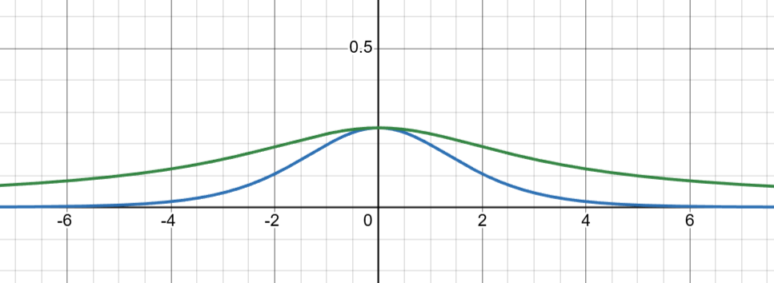
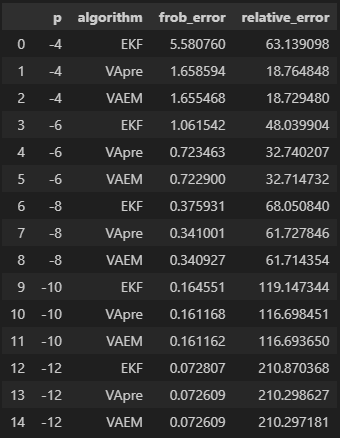
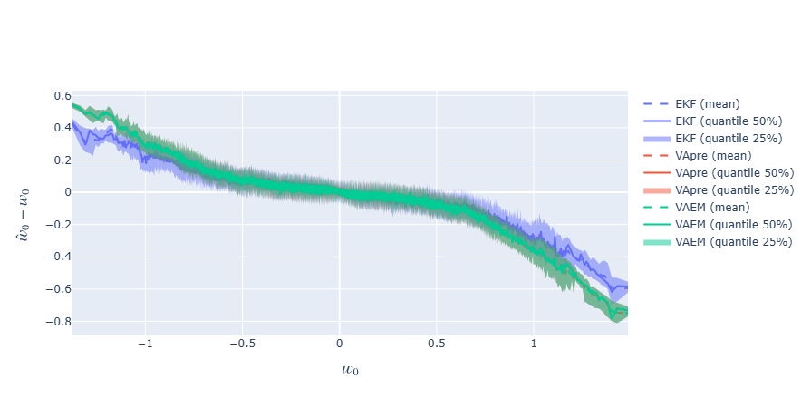
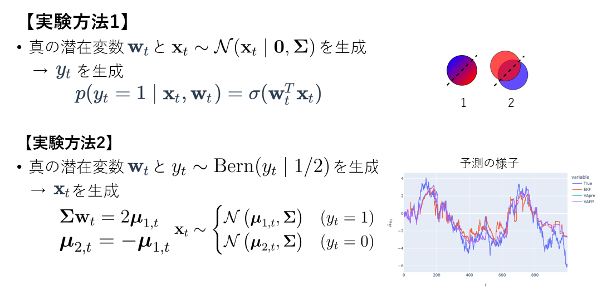
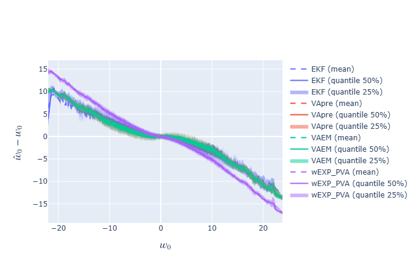

# 実験ノート

<!-- WARNING: THIS FILE WAS AUTOGENERATED! DO NOT EDIT! -->

## 12/02.1

### 概要

新たな評価基準を設けた。それによる考察を兼ねて、実験結果を整理する。

### 実験

次元数 2 、*w*0 = (0, 0)*T*
で、次の４象限に分けて実験結果をまとめた。

<table>
<thead>
<tr>
<th><strong>Γ</strong></th>
<th><strong>Σ</strong></th>
</tr>
</thead>
<tbody>
<tr>
<td>2−4<strong>I</strong></td>
<td>2−2<strong>I</strong></td>
</tr>
<tr>
<td>2−4<strong>I</strong></td>
<td>24<strong>I</strong></td>
</tr>
<tr>
<td>2−12<strong>I</strong></td>
<td>2−2<strong>I</strong></td>
</tr>
<tr>
<td>2−12<strong>I</strong></td>
<td>24<strong>I</strong></td>
</tr>
</tbody>
</table>

### 結果

<figure>

<figcaption aria-hidden="true">エビフライトライアングル</figcaption>
</figure>

- **w***t* の遷移が大きい（ **Γ**
  が大きい）ほど、(EKFよりも)変分近似が優れる
- **x** の分散に関しては、単純に優劣の評価ができない。

<figure>

<figcaption aria-hidden="true">aaa</figcaption>
</figure>

- **x***t* の分散や **w***t*
  の分散は、単純にスケールされている点に注意が必要

## 12/10.1

### 概要

推定誤差共分散行列は、両者に明確な大小がある。

**P***t*/*t*−1 = **P***t*/*t* − 1−1 + *σ**t*(1 − *σ**t*)**x***t***x***t**T*

**P***t*/*t*−1 = **P***t*/*t* − 1−1 + 2*λ*(*ξ**t*)**x***t***x***t**T*

- 青: *σ*(*x*){1 − *σ*(*x*)}
- 緑:
  $2\lambda(x)=\displaystyle\frac{1}{x}\left(\sigma(x)-\frac{1}{2}\right)$

<figure>

<figcaption aria-hidden="true">aaa</figcaption>
</figure>

### 実験

$$\overline{\mathbf P}=\frac{1}{N\_{\text{seed}}T}\sum\_{s,t}\text{seed} (s) \text{における}\mathbf P\_{t/t}$$
$$\text{frob\\error}=\\\overline{\mathbf P}-\mathbf\Gamma\\\_F$$
$$\text{relative\\error}=\frac{\text{frob\\error}}{\\\Gamma\\\_F}$$
**Γ** = 2*p***I**

<figure>

<figcaption aria-hidden="true">aaa</figcaption>
</figure>

### 備考

*p*(**w***t* ∣ **w***t* − 1) = 𝒩(**w***t* ∣ **w***t* − 1, **Γ**)
$$p(\mathbf w_t\mid\mathbf Y_t) = \mathcal N(\mathbf w_t\mid\hat{\mathbf w}\_{t/t},\mathbf P\_{t/t})$$

**Y***t* には **w***t* − 1
の情報が入っているので、次の２つの式はほとんど同じ

*p*(**w***t*) = ∫*p*(**w***t* ∣ **Y***t*)*p*(**Y***t*)*d***Y***t*

*p*(**w***t* ∣ **w***t* − 1) = ∫*p*(**w***t* ∣ **w***t* − 1, **Y***t*)*p*(**Y***t*)*d***Y***t*

実験では、**P***t*/*t* に対して期待値をとっている。

## 12/16.1

### 概要

表に対して、比較するグラフを作成。

<table>
<colgroup>
<col style="width: 33%" />
<col style="width: 33%" />
<col style="width: 33%" />
</colgroup>
<thead>
<tr>
<th> </th>
<th>Frobenius error</th>
<th>Relative error</th>
</tr>
</thead>
<tbody>
<tr>
<td>normal plot</td>
<td></td>
<td></td>
</tr>
<tr>
<td>log plot</td>
<td></td>
<td></td>
</tr>
</tbody>
</table>

### 考察

**Γ**
の大きさに合わせて、フロベニウス誤差が線形に増加しているのが正常であると考えられる。

<table>
<colgroup>
<col style="width: 33%" />
<col style="width: 33%" />
<col style="width: 33%" />
</colgroup>
<thead>
<tr>
<th> </th>
<th><em>p</em> = −4</th>
<th><em>p</em> = −12</th>
</tr>
</thead>
<tbody>
<tr>
<td><em>ŵ</em><em>t</em>1 − <em>w</em><em>t</em>1</td>
<td></td>
<td></td>
</tr>
</tbody>
</table>

## 12/23.1

### 概要

データの生成過程を変更して実験を行ったが、結果があまり変わらなかった。

<figure>

<figcaption aria-hidden="true">aaa</figcaption>
</figure>

## 1/6.1

### 概要

濾波推定値 **w***t*/*t* を EKF によって推論し、誤差共分散行列
**P***t*/*t* を変分近似で推論する手法を試した。

通常の EKF と比較して、性能が向上すれば、EKF
の誤差共分散行列の推定が不適切であることを部分的に示すことができる。

$$\hat{\mathbf w}\_{t/t}=\hat{\mathbf w}\_{t/t-1}+\frac{1}{1+\sigma_t(1-\sigma_t)\mathbf x_t^T\mathbf P\_{t/t-1}\mathbf x_t}\mathbf P\_{t/t-1}\mathbf x_t(y_t-\sigma_t)$$

$$\mathbf P\_{t/t}=\mathbf P\_{t/t-1}-\frac{2\lambda(\xi_t)}{1+2\lambda(\xi_t)\mathbf x_t^T\mathbf P\_{t/t-1}\mathbf x_t}\left(\mathbf P\_{t/t-1}\mathbf x_t\right)\left(\mathbf P\_{t/t-1}\mathbf x_t\right)^T $$

$$\xi_t=\sqrt{\mathbf x_t^T\left(\mathbf P\_{t/t-1}+\hat{\mathbf w}\_{t/t-1}\hat{\mathbf w}\_{t/t-1}^T\right)\mathbf x_t}$$

### 結果

wEXP_PVA がここで定義した手法

- この手法はどのパラメータにおいても、変分近似に劣る
- EKF
  のばらつきが大きいパラメータにおいては、この手法はばらつきがそれほど大きくない
- EKF のばらつきは、誤差共分散行列によって引き起こされていると考えられる

<table>
<thead>
<tr>
<th> </th>
<th><em>p</em> = −4</th>
</tr>
</thead>
<tbody>
<tr>
<td><em>q</em> = −2</td>
<td></td>
</tr>
<tr>
<td><em>q</em> = 2</td>
<td></td>
</tr>
<tr>
<td><em>q</em> = 4</td>
<td></td>
</tr>
</tbody>
</table>
